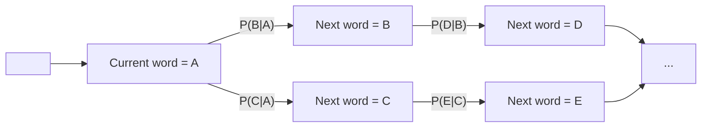

# Session 1: What is a Language Model? (N-gram Basics)

## Teaching Script

### Introduction & Motivation

Welcome to the world of **Language Models (LMs)**! A language model is simply a system that **predicts the next word** in a sequence, given some previous words. You might not realize it, but you encounter language models every day – for example, when your phone suggests the next word while you're typing a message. Today, we'll start with the most basic kind of language model: the **N-gram model**, specifically a **bigram model** (which is an N-gram model where N=2). This will introduce key ideas of how we can use probability and counting to make predictions about language.

### Key Concept – Predicting the Next Word

Imagine you have the phrase "**Good morning, how are ...**". Even without finishing the sentence, you can guess the next word might be "**you**". A language model does something similar: based on the words it has already seen ("Good morning, how are"), it predicts what comes next. Formally, if we denote the previous words as a history h and the next word as w, a language model gives a probability P(w|h) – the likelihood that w is the next word given history h. In our example, P(you|"Good morning, how are") would hopefully be higher than, say, P(banana|"Good morning, how are")! But how do we come up with these probabilities?

### The Simplest Approach – Counting (N-grams)

One straightforward way is to use **counts of word sequences** from a large text, i.e., a corpus. The idea is: the more often a word follows a given history in real text, the more likely our model should predict it. However, counting whole long histories (like entire sentences) is impractical because you'd rarely see the exact same long sentence twice. This is where we simplify the problem using the **Markov assumption**. The Markov assumption says that to predict the next word, you don't need the *entire* history – just the last few words may suffice. For an **N-gram model**, we only look at the last N-1 words. In a **bigram (2-gram) model**, we look at **only the last 1 word**. Essentially, we approximate:

$$P(w_n | w_1, w_2, \ldots, w_{n-1}) \approx P(w_n | w_{n-1})$$

That is, "the probability of the next word $w_n$ given all prior words is approximated by the probability of $w_n$ given just the immediately preceding word $w_{n-1}$". This simplification is our **bigram assumption** (a specific case of the Markov assumption). By making this assumption, we only need to count how often each word follows each other word.

### Bigram Model Mechanics

In a bigram model, we calculate P(next word | current word) using counts from our corpus. For example, suppose in our corpus the word "the" is followed by "cat" 50 times and followed by "dog" 20 times. Then the probability P("cat"|"the") is estimated as 50/(50+20) = 0.714 (assuming "cat" and "dog" are the only two possibilities after "the" in this tiny corpus). More generally,

$$P(w_{next} | w_{current}) = \frac{Count(w_{current}, w_{next})}{Count(w_{current})}$$

This fraction means *"of all occurrences of the current word, how many times was it followed by the next word?"*. By computing this for every possible word pair (bigram) that appears in our text, we build a probability table. This table is essentially the "knowledge" of our bigram language model.

### Example

Imagine a very small corpus of text: "*the cat sat on the mat. the cat ate a fish.*" From this corpus, we can gather some bigram counts:
- "the" followed by "cat" occurs 2 times.
- "cat" followed by "sat" occurs 1 time.
- "cat" followed by "ate" occurs 1 time.
- "sat" followed by "on" occurs 1 time.
- … and so on for each adjacent word pair in the corpus.

We can then turn these counts into probabilities. For instance, after the word "the" in our corpus, the next word was "cat" 2 out of 2 times (assuming only those two sentences). So our model would predict "cat" after "the" with probability 1 (or 100%) in this tiny corpus. After "cat", the next word was "sat" once and "ate" once, so P(sat|cat)=0.5 and P(ate|cat)=0.5. In a real, much larger corpus, these probabilities would be spread across many possible next words.

### Using the Model – Predicting & Generating Text

Once we have these bigram probabilities, we can **predict the next word** by choosing the one with the highest probability given the current word. For example, if our model has P(morning|good)=0.4 and P(night|good)=0.1 (and other words have the rest of the probability), it would predict "morning" after "good" because it's more likely in the training data. We can also **generate text** with the model by treating it like a little game: start with a seed word (say "Once"), then use the model to randomly pick the next word according to the learned probabilities, append it, then move on. This is essentially how we *sample* from the model to create new sentences. For instance, if starting at "Once", if our model knows "Once" is often followed by "upon", it will likely pick "upon" as next. Then with "upon" as current, it might pick "a", then "time", and so on, perhaps generating the classic start "Once upon a time".

Behind the scenes, generating text is like walking through a **Markov chain** where each state is the current word, and transitions to the next word happen with probabilities determined by our bigram table. One way to visualize this is to imagine a map of words connected by arrows: each arrow from word A to word B is labeled with P(B|A). Starting at some word, you follow an arrow to pick the next word (randomly, but weighted by those probabilities), and continue.

### Analogy

Think of a bigram model like a **predictive text keyboard** or an auto-complete. When you type a word, the system looks at that word and suggests what the next word could be. It's not thinking deeply or understanding meaning – it's basically saying "In the texts I've seen, after *this* word, *these* words often come next." If "Good morning" was common in its memory, then after you type "Good", it might suggest "morning". If you typed "Good" and then "night" often follows in its memory, it might suggest "night" next. This is exactly what our bigram model does with probabilities instead of absolute suggestions.

### Limitations of N-gram Models

While N-gram models (like our bigram model) are easy to understand and implement, they have **limitations**. One major issue is that they have **limited memory** of context. A bigram model only knows about the last one word – it cannot handle situations where the context of two or more words ago is important. For example, consider the two sentences: "I **ate** a sandwich and I was full." vs "I **saw** a sandwich and I was full." A bigram model, only looking one word back, might not see a difference after the word "I" – it doesn't "remember" whether the word before "a sandwich" was "ate" or "saw" by the time it gets to "was full." Thus, it might treat both contexts similarly, even though the meaning differs. Generally, N-gram models can struggle when **longer-range dependencies** matter (like subject-verb agreement that might be several words apart, or the topic of a paragraph influencing word choice later).

Another limitation is the **data sparsity** problem. Language is vast and creative – many valid sentences or phrases will not appear in your training corpus. If an N-gram model never saw a particular word sequence during training, it will assign it zero probability, meaning it thinks that sequence is impossible (when in reality it might just be rare or absent in the training data). For example, if our corpus never contained the phrase "astronaut launches", a bigram model would have no data for P(launches|astronaut) and would essentially consider it an impossible pair. This isn't true in real language – it's just we didn't see it in our limited data. There are techniques like **smoothing** to handle this (which basically steal a little probability mass from frequent events and give it to unseen events), but that's a bit beyond our initial session. For now, it's enough to recognize that simple models need a lot of data to cover many possibilities, and even then, they have blind spots.

In summary, the bigram model is our first stepping stone. It captures some local structure of language (common two-word combinations) and will serve as a baseline. By the end of this week, you will *implement* a bigram model yourself, use it to analyze text, and even generate a few random sentences. This simple model will also help motivate the more advanced approaches in subsequent weeks: we'll see why we need more powerful models (like neural networks and attention) to handle the complexities of natural language.

---

## Presentation Slides

### What's a Language Model (LM)?

- A system that predicts the **next word** given previous words (context).
- Everyday example: your phone's **autocorrect/suggestions** guessing your next word as you type.
- We measure this as a probability P(next word | previous words).

### Bigram Model – The Simplest LM

- Uses only **1 previous word** to predict the next word (N-gram with N=2, so N-1=1 context word).
- **Markov assumption:** the next word depends only on the last word, not the entire history.
- Learns from text by **counting word pairs**. Example: If "rainy" is followed by "day" 30 times and "night" 10 times, P(day|rainy) = 30/40 = 0.75.

### How a Bigram Model Works

- **Training:** Go through a large text and tally counts of every word bigram (pair). Compute probabilities: P(B|A) = Count(A followed by B) / Count(A).
- **Prediction:** Given a current word, look up which words tend to follow it and with what probabilities.
- **Generation:** Start with a seed word and repeatedly *roll the dice* using these probabilities to pick each next word. This creates a random sentence that *sounds* like the training text in terms of local word pair patterns.

### Visualization – Text Generation as a Flowchart

The model moves from word to word, using bigram probabilities as transition rules.
Each step: look at current word, pick next word based on learned odds.



*(Flowchart: At "Current word = A", model may go to B with probability P(B|A) or to C with probability P(C|A). From B, it can go to D next, etc. This illustrates random walk through words.)*

### Strengths & Weaknesses of N-gram Models

- ✅ **Easy to understand & implement:** Just counting and probability.
- ✅ Captures common local patterns ("thank you", "Good morning").
- ❌ **Short memory:** Knows only the last N-1 words. Can't handle longer context or complex dependencies.
- ❌ **Data sparsity:** Assigns zero probability to any never-seen combination (e.g., new phrases), which is unrealistic without smoothing.
- ❌ Can produce repetitive or nonsensical output if context is insufficient ("the the the …").

### Why We Need More

- Language has long-range structure (e.g., a word later might depend on one several words earlier).
- To improve, we'll need models that **remember more** than just one or two words – this motivates moving beyond simple N-grams to models with **memory and learning** (foreshadowing neural networks and beyond).

---

## Code Walkthrough

```python
# Bigram Language Model - Counting and Probability Demo

# 1. Sample corpus (small text) for demonstration:
corpus = "the cat sat on the mat. the cat ate a fish."

# 2. Preprocessing: split text into words (tokenization)
words = corpus.lower().replace(".", " <END> ").split()
# We insert <END> token to mark sentence end for clarity (optional)
# Now 'words' is a list like: ['the','cat','sat','on','the','mat','<END>',
#                               'the','cat','ate','a','fish','<END>']

# 3. Count unigrams (single words) and bigrams (pairs of consecutive words)
import collections
unigram_counts = collections.Counter()
bigram_counts = collections.Counter()

# Populate counts by iterating through word list
prev_word = None
for word in words:
    unigram_counts[word] += 1
    if prev_word is not None:             # if there is a previous word (not at start)
        bigram_counts[(prev_word, word)] += 1
    prev_word = word
# Note: This simple loop treats the corpus as one stream.
# Using <END> ensures we count sentence-ending pairs appropriately.

# Display the counts (for understanding)
print("Unigram counts:", unigram_counts)
print("Bigram counts:", bigram_counts)

# 4. Compute bigram probabilities
bigram_probs = {}
for (w1, w2), count in bigram_counts.items():
    prob = count / unigram_counts[w1]
    bigram_probs[(w1, w2)] = prob
    # Explanation: P(w2 | w1) = Count(w1 w2) / Count(w1)

# Display some example probabilities
example_pairs = [("the", "cat"), ("cat", "sat"), ("cat", "ate"), ("cat", "mouse")]
for pair in example_pairs:
    if pair in bigram_probs:
        print(f"P({pair[1]}|{pair[0]}) = {bigram_probs[pair]:.2f}")
    else:
        # If a pair never occurred, we can treat probability as 0 (or apply smoothing later)
        print(f"P({pair[1]}|{pair[0]}) = 0 (unseen pair)")

# 5. Using the model to generate a random sentence
import random
sentence = []
current_word = "the"   # Let's start with "the" for example
for _ in range(10):    # generate up to 10 words
    sentence.append(current_word)
    # Collect possible next words and their probabilities for current_word
    candidates = [(w2, prob) for (w1, w2), prob in bigram_probs.items() if w1 == current_word]
    if not candidates:
        break  # stop if no known continuation (e.g., reached an <END> or unknown word)
    # Use random.choices to pick next word according to probabilities
    next_words, probs = zip(*candidates)
    current_word = random.choices(next_words, weights=probs, k=1)[0]
    if current_word == "<END>":
        break  # end generation if end-of-sentence token is reached

generated_sentence = " ".join(sentence)
print("Generated sentence:", generated_sentence)
```

### What this code does:

- We define a small corpus (just two sentences for this demo). In a real scenario, this could be a large text file. We lowercase everything and insert `<END>` tokens to mark sentence boundaries, which helps the model treat end-of-sentence explicitly.
- We **tokenize** the text into a list of words.
- We then **count unigrams and bigrams** using a loop. `unigram_counts[word]` counts each word's occurrences. `bigram_counts[(prev_word, word)]` counts each observed word pair. For example, in our sample corpus, the pair `("the", "cat")` will be counted twice.
- Next, we compute bigram **probabilities**. For each bigram `(w1, w2)` in our counts, we divide by the total count of `w1`. The result is stored in `bigram_probs`. So if `("the", "cat")` count is 2 and "the" occurred 2 times in total, `P(cat|the)` becomes 1.0 in this tiny corpus. We demonstrate by printing a few example probabilities, including an unseen pair `("cat", "mouse")` which would not be in `bigram_probs` (hence probability 0 without smoothing).
- Finally, we show how to **generate text**. We start with a chosen `current_word` (here "the"). Then in a loop, we look up all candidate next words that can follow `current_word` (from our `bigram_probs`). We use `random.choices` with weights equal to those probabilities to randomly pick the next word. We append the current word to the sentence list as part of the output, update `current_word` to the chosen next word, and repeat. We break out if we hit an `<END>` or if there's no known next word. The result is a randomly generated sentence stored in `generated_sentence`.

### Sample Output:

```
Unigram counts: Counter({'the': 2, 'cat': 2, 'sat': 1, 'on': 1, 'mat': 1, '<END>': 2, 'ate': 1, 'a': 1, 'fish': 1})
Bigram counts: Counter({('the', 'cat'): 2, ('cat', 'sat'): 1, ('sat', 'on'): 1, ('on', 'the'): 1, ('the', 'mat'): 1, ('mat', '<END>'): 1, ('cat', 'ate'): 1, ('ate', 'a'): 1, ('a', 'fish'): 1, ('fish', '<END>'): 1})
P(cat|the) = 1.00
P(sat|cat) = 0.50
P(ate|cat) = 0.50
P(mouse|cat) = 0 (unseen pair)
Generated sentence: the cat sat on the mat
```

### Discussion

This simple code demonstrates the core of an N-gram model. It reveals a few things:
- Common pairs get high probability (in our data "the→cat" was certain). If we had more varied data, probabilities would distribute more smoothly.
- Unseen pairs are simply not generated (we had no chance of "cat → mouse" because it wasn't in training data, leading to zero probability).
- The generated text respects the patterns of the training data but doesn't have any global planning – it's *local*. In our case, it recreated a learned sentence. With random picking, it could have also done "the cat ate a fish" (the other sentence) or conceivably mixed parts.
- If we try to generate a very long sentence, the model might wander into a dead-end (a word that was only ever seen at the end of a sentence, so it can't continue). In our code, we break out if no candidates or if `<END>` is reached.

This bigram model is a baseline. Keep this code in mind – you now have a functioning (if rudimentary) language model! In the next session, we'll use it to analyze a slightly larger corpus and get some interesting stats and sentences out, and that will wrap up our N-gram exploration before moving on to neural network approaches.

---

## Quiz / Exercises

### 1. Concept Check
In a bigram model, what information do we use to predict the next word?

a. The entire sentence so far.
b. Only the immediately preceding word.
c. The topic of the text.

**Answer:** b. Only the immediately preceding word (that's the Markov assumption for bigrams).

### 2. Probability Calculation
Suppose in a corpus, the word "London" appears 100 times. Out of those 100 occurrences, 30 times it's followed by "is", 20 times by "was", 5 times by "in", and the rest are all other words (each less frequent).

**(a)** What is P("is"|"London") according to the bigram model?

**(b)** If "London" is never followed by the word "sunny" in the corpus, what probability will the model assign to P("sunny"|"London")?

**Answer:**
(a) P(is|London) = 30/100 = 0.3 (30%).
(b) It will assign 0, since that pair wasn't seen (assuming no smoothing).

### 3. Practical Thinking
Why might a bigram model confuse the two sentences "The dog **chased** the cat" and "The dog **scared** the cat"? (Hint: think about what context the model uses for the word "the" before "cat".)

**Answer:** In both sentences, by the time the model is at the word "the" before "cat", the immediate previous word is "scared" in one case and "chased" in the other. A bigram model only looks one word back, so it considers P(cat|the) without remembering whether "the" came after "chased" or "scared". Actually, the model would be predicting "cat" after "the" (based on how often "the cat" appears overall) and **does not** take into account the verb two words back. Thus, it treats the contexts the same and might miss differences in meaning or grammar that depend on the verb.

### 4. Data Exploration
Take a small sample text (a paragraph from a book or article) and manually write down the bigrams it contains. (i) List five bigram pairs from the text. (ii) Identify if any word in that text always follows a particular word (like in our tiny corpus, "the" always followed by "cat"). What does that tell you about the text or the model?

**Answer:** *(Open-ended, but expected outcome: Students list actual bigrams from their sample. They might notice, for example, common pairs like ("Mr.", "Holmes") if the text was Sherlock Holmes, or ("New", "York"). If a word always follows another in the sample, it likely means the sample is small or that phrase is a fixed expression. The student should note that the model would then deterministically predict that follower after the given word.)*

### 5. Critical Thinking
What do you think will happen if we use a trigram model (N=3) instead of a bigram? What's one benefit and one drawback of using trigrams?

**Answer:** A trigram model uses the last 2 words of context instead of 1. Benefit: it captures more context, so it can distinguish situations that a bigram would confuse (it knows "scared the cat" vs "chased the cat" because the two-word contexts "scared the" vs "chased the" are different). It can generate more coherent phrases because it conditions on a broader history. Drawback: It needs significantly more data to get good statistics for every possible pair of context words. There are more possible 2-word combinations than single words, so data sparsity becomes an even bigger issue – many trigrams might never be seen. Also, the model is larger (more storage needed for counts) and slower to train if done naively. Essentially, higher N means more context but exponentially more data required.
