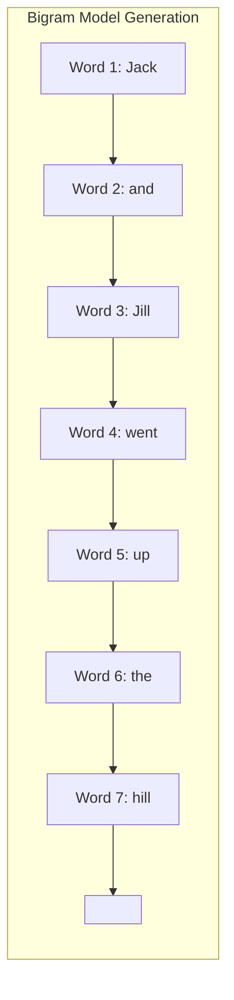

# Session 2: Building and Using a Bigram Model (Analysis & Demo)

## Teaching Script

### Recap

Last session, we learned what a bigram language model is and how it uses word pair frequencies to predict the next word. We even sketched a simple bigram model in code. Today, we'll get hands-on and **build a bigram model from scratch**, then use it to analyze a text corpus and generate some example text. This will solidify the concept and also illustrate the model's strengths and weaknesses in action.

### Step 1: Choosing a Corpus (Text Data)

To train any language model, we need text data. The larger and more representative the text, the better the model generally becomes. For our demo purposes, we might use a relatively small corpus (for example, a few chapters of a book, a collection of nursery rhymes, or any text you find interesting). The first step is **loading and preprocessing** the text:
- We typically convert all text to a uniform case (lowercase) to avoid treating "The" and "the" as different words.
- We might remove punctuation or handle it in a simple way (e.g., treat sentence-end punctuation as markers or just remove them).
- We then split the text into words (tokenization). For simplicity, splitting on whitespace and punctuation is often okay to start, though in real NLP, tokenization can get more complex (handling contractions, etc.).

### Step 2: Building the Bigram Table

Using the approach from Session 1, we go through the text word by word and count how often each word follows each other word. This will produce:
- A dictionary (or table) of bigram counts, e.g., `count["rain"]["fall"] = 15` meaning "rain fall" occurred 15 times.
- A dictionary of single word counts, e.g., `count["rain"] = 30` meaning "rain" appeared 30 times in total (so we know how many opportunities there were for any word to follow "rain").

From these, we compute the probability P(next|current) = count(current,next) / count(current). It might be useful not just to compute these probabilities but also to inspect them. We can find, for instance:
- What is the most likely word after "rain"?
- What words can start a sentence (maybe look at what often follows a period or start-of-sentence token)?
- Which word has the most diverse set of followers vs which is almost always followed by one particular word (like "Good" might often be followed by "morning" or "evening").

### Step 3: Exploring the Model (Corpus Analysis)

Before generating text, it's insightful to analyze the corpus via the model's lens:
- **Frequency Analysis:** Which words are most common overall (unigram frequencies)? Often, function words like "the", "of", "and" top the list in English. This is expected and tells us such words will heavily influence predictions.
- **Likely Pairs:** For a given word, what are the top 3 most likely next words according to the model? For example, if you use a corpus of fairy tales, after "once", the most likely next word might be "upon" (forming "once upon"). After "he", common next words might be "said", "was", "had", etc.
- **Surprising Patterns:** Sometimes models pick up on names or specific phrases. If "New York" appears often, the model will strongly connect "New" -> "York". If "ladies and gentlemen" appears often, "ladies" -> "and" might be near 100% and "and" -> "gentlemen" similarly high when following "ladies".
- We can query our model data structure to answer questions like "How many distinct words follow 'the'?" or "Is there any word that never appears as a next word for any other? (Those would be words that only start sentences perhaps.)"

By examining these, we connect the raw data to how the model "sees" language. This also helps highlight limitations; for example, if you find P("bank"|"the") is high because of phrases like "the bank", the model doesn't know if "bank" means a financial bank or river bank – it's just counting. It has no concept of meaning, only usage frequency.

### Step 4: Generating Text

Now the fun part – using the bigram model to generate text. This is like those "predictive text" games. We need a starting point: typically a start-of-sentence token or simply pick a word to start with (maybe a capital letter word if we preserved case and punctuation for realism, or just any common word). Then repeatedly:
1. Look up the distribution of next words after the current word.
2. Randomly select the next word according to that distribution.
3. Append it and move on.

We continue until we hit a special end-of-sentence token (if we included one) or until we have generated a desired length of text.

**Important detail:** If the model ever lands on a word that was never seen as a "current word" in training (which can happen if that word only ever appeared at the very end of the corpus, like a last word of the entire text with no following word), then we have no next-word data. To handle this, we might include a generic end-of-sentence token in training, so every sentence has a known "next word" at its end (the `<END>` marker), ensuring every word in a sentence has some recorded follower (even if it's `<END>`). In generation, if we hit `<END>`, we can stop or choose to start a new sentence.

### Let's consider an example

If we trained on a bunch of nursery rhymes, and we start with "Jack", the model might go:
- "Jack" (start) -> likely next "and" (if "Jack and Jill" is common, P(and|Jack) is high).
- "and" -> likely "Jill".
- "Jill" -> likely "went" (from "Jill went up the hill").
- ... and so on.

It might end up recreating "Jack and Jill went up the hill" if those probabilities dominate. Or it could veer off if there's variance in data (maybe "Jack jumped over" from "Jack jumped over the candlestick" might also be a possibility if that rhyme was in the training data). Because generation involves randomness, each run can produce different outputs. Sometimes the output will be valid-sounding; other times it might be grammatically awkward or abruptly end if an uncommon sequence was chosen.

### Observation

The bigram model generally produces **locally plausible** text but not globally coherent text. It might capture common two-word combos, but it has **no memory of earlier context beyond one word**. For instance, it could generate a sentence like: "The cat ate a fish <END> The cat sat on a fish <END>" etc., which individually each small segment was something seen in training, but the overall might sound repetitive or silly. Or it might do something grammatically off if it stitches together mismatched pairs across a sentence boundary.

This demonstrates why, although N-gram models can generate *somewhat realistic gibberish*, they often fail to capture the nuance of longer text. Real examples: a trigram model might produce sentences that kind of start making sense and then wander off as the context gets lost.

### Reflection – Preparing for Next Steps

By the end of this session, you will have a working bigram model and first-hand experience with its output. Take a moment to reflect on what was easy or hard for this model:
- It was easy to set up with counting.
- It quickly learned common short patterns.
- But to "remember" anything beyond one word, it fails. If the corpus had a sentence like "Alice took the rabbit and then she followed it down the hole", a bigram model at "she" only sees "she" preceded by "then" (maybe) and has no clue that "Alice" was the subject. It might just as well have seen "she" often followed by "said" and output "she said ..." continuing incorrectly for that context.

These limitations clearly point us towards wanting a model that can learn more **flexible** patterns and **longer dependencies**. That is exactly where we are headed: starting next week, we'll introduce neural network-based language models, which address some of these issues by learning distributed representations and theoretically considering more context. But before that, let's cement our understanding of bigrams with coding and experimentation now.

---

## Presentation Slides

### Preparing Text Data

- Use a corpus (collection of text) as training data.
- **Clean & tokenize:** lowercase the text, remove punctuation or treat it specially, split into words.
- Optionally add special tokens (e.g., `<END>` for sentence boundaries) to help model sentence starts/ends.

### Building the Bigram Model

- **Count word occurrences:** how often each word appears (unigram counts).
- **Count word pairs:** how often each word is followed by another (bigram counts).
- **Calculate probabilities:** P(next|current) = Count(current, next) / Count(current). Store these in a table/dictionary for lookup.
- The result: a probability table of size ~ (number of unique word pairs seen).

### Analyzing the Corpus via the Model

- *Most frequent words:* Identify top 5 most common words (likely "the", "and", etc.).
- *Common followers:* For a given word, list the top 3 next words with probabilities. (E.g., after "once", P(upon) might be high; after "he", P(said) might be high.)
- *Diversity:* Some words have many possible followers (e.g., "the" can be followed by dozens of different words), while others are more fixed (e.g., "New" is almost always followed by "York" in a corpus about geography).
- *Examples:* If we see "New" 50 times and 45 of those are "New York", then P(York|New) = 0.9 (90%). The model strongly links "New" -> "York".

### Generating Text from the Bigram Model

- Pick a **start word** (or a start token).
- Loop: at current word, **randomly choose** the next word based on the learned probabilities (higher probability = more likely to be picked).
- Continue until reaching an `<END>` token or a set length.
- Each run can produce a different random sentence, but *locally* it will use plausible word pairs from training data.

### Example Generation Flow (bigram)



*Diagram: Starting with "Jack", the model picked "and" (because in training "Jack and" was common), then "Jill", then "went", etc., eventually producing the nursery rhyme start "Jack and Jill went up the hill". Each arrow choice is guided by bigram probabilities.*

### Output Characteristics

- Locally coherent phrases (familiar two-word combos).
- Globally, might wander or repeat. E.g., could generate "and the cat and the cat ..." if "and the" is common, because after "and" -> "the", then "the" -> maybe "cat", then "cat" -> maybe "and" again, forming a loop.
- No understanding of grammar beyond 2-word context: might start a sentence in one style and end in another, or lose subject-verb agreement if the dependency is longer than a bigram.

### Limitations Observed

- **Zero probabilities:** Any unseen pair can't be generated (if never saw "purple elephant", model will never say "purple elephant"). Smoothing could mitigate this, but our basic model doesn't have it.
- **Short memory:** Can't enforce consistency. Example: if the text to generate is long, a bigram model has no memory of what the subject was in the beginning by the time it's in the middle.
- **Repetitiveness:** With certain structures, model can loop (e.g., if "X -> Y" and "Y -> X" are both likely, it might alternate X, Y, X, Y...). Human text usually doesn't repeat like that beyond a point, but the model doesn't "know" that repeating four times is odd. It just follows pair probabilities each step.

### Why Not Stop at N-grams?

- They're **too rigid** and **data-hungry**. To get better, you'd increase N (trigram, 4-gram, etc.), but that demands exponentially more data to avoid zeros.
- They can't capture *abstract* similarities. For example, they treat every word as unrelated to others except by direct neighbor counts. They wouldn't generalize that "dog" and "cat" might appear in similar contexts; if "the dog barked" is in training but "the cat barked" is not, a bigram model gives zero to the latter even though a cat *could* bark (theoretically!).
- **Foreshadowing:** Neural networks will address these by *learning from data* in a smoother way, and by using continuous vector representations (embeddings) that can generalize to unseen combinations. Also, recurrent and attention-based models will extend effective memory.

---

## Code Walkthrough

```python
# Building a bigram model for a larger text corpus and generating text

# 1. Load a sample text corpus
# For demonstration, we'll use a small built-in text or a hardcoded string.
# (In practice, you might load from a file.)
corpus = """Jack and Jill went up the hill to fetch a pail of water.
Jack fell down and broke his crown, and Jill came tumbling after.
Humpty Dumpty sat on a wall. Humpty Dumpty had a great fall.
All the king's horses and all the king's men couldn't put Humpty together again.
"""

# Preprocess: lowercase and replace newline with space.
text = corpus.lower().replace("\n", " ")
# Insert a special <END> token at sentence boundaries (after punctuation).
import re
text = re.sub(r"([.!?])", r" \1 <END>", text)  # put space before end token
text = text.replace(".", "")  # remove actual periods (now we rely on <END>)
tokens = text.split()
# Now 'tokens' is the list of words including <END> markers.

# 2. Build the bigram counts and probabilities
from collections import defaultdict, Counter
bigram_counts = Counter()
word_counts = Counter()

prev_word = None
for word in tokens:
    if word == "<end>":
        # treat <END> as a word and also reset prev_word to None (end of sentence)
        word_counts[word] += 1
        if prev_word is not None:
            bigram_counts[(prev_word, word)] += 1
        prev_word = None
    else:
        # regular word
        word_counts[word] += 1
        if prev_word is not None:
            bigram_counts[(prev_word, word)] += 1
        prev_word = word

# Calculate probabilities
bigram_prob = {}
for (w1, w2), count in bigram_counts.items():
    bigram_prob[(w1, w2)] = count / word_counts[w1]

# 3. Explore some statistics from the model
print("Total unique words:", len(word_counts))
print("Most common words:", word_counts.most_common(5))
example_words = ["jack", "humpty", "and", "the"]
for w in example_words:
    # find top 3 followers of each example word
    followers = [(pair[1], prob) for pair, prob in bigram_prob.items() if pair[0] == w]
    followers.sort(key=lambda x: x[1], reverse=True)
    top3 = followers[:3]
    print(f"Top followers of '{w}':", ", ".join([f"'{fw}' ({p:.2f})" for fw, p in top3]))

# 4. Generate a random rhyme using the bigram model
import random
sentence = []
# Start with a random word that often begins a sentence.
# A simple way: choose a word that commonly follows an <END> or starts after None.
start_candidates = [w2 for (w1, w2), prob in bigram_prob.items() if w1 == None or w1 == "<END>"]
current_word = random.choice(start_candidates) if start_candidates else random.choice(list(word_counts.keys()))
print("Starting word:", current_word)
# Generate words until an <END> or length limit
for _ in range(20):  # limit to 20 words for safety
    if current_word == "<end>":
        break
    sentence.append(current_word)
    # pick next word based on probabilities
    candidates = [(w2, prob) for (w1, w2), prob in bigram_prob.items() if w1 == current_word]
    if not candidates:
        break
    next_words, probs = zip(*candidates)
    current_word = random.choices(next_words, weights=probs, k=1)[0]

generated = " ".join(sentence)
print("Generated text:", generated)
```

### Explanation

- We load a sample corpus containing some nursery rhymes (Jack and Jill, Humpty Dumpty, etc.). This gives a variety of simple sentences with some repetition of names (like "Humpty Dumpty" appears twice at sentence starts) and some structure we can examine.
- Preprocessing: We lowercase everything and insert `<END>` tokens. I used a regex to put `<END>` after punctuation like periods, exclamation or question marks, then removed the actual punctuation (so "." is removed but `<END>` stays as a token indicating that's where a sentence ended). After that, we split into tokens. Now every sentence in the corpus ends with an `<END>` in the token list.
- We build `bigram_counts` and `word_counts`. Notice we handle the `<END>` token explicitly: when we see `<END>`, we still count it as a word occurrence and add a bigram for the previous word to `<END>`. We then reset `prev_word` to None because the sentence ended (meaning if the next word is a start of a new sentence, we don't want to link `<END>` to that start word).
- Then we compute `bigram_prob` exactly as before.

We print out some stats:
- Total unique words.
- The 5 most common words (with their counts). Likely outcome: words like "the" or names like "humpty", "and", "jack" might top because of repetition in rhymes.
- For some example words ("jack", "humpty", "and", "the"), we find the top 3 followers.
  - "jack" might be often followed by "and" (from "Jack and Jill"), perhaps also "fell" (from "Jack fell down"), etc.
  - "humpty" likely followed by "dumpty" almost every time (in our corpus "Humpty" is always followed by "Dumpty" – so P(Dumpty|Humpty) may be ~1.0).
  - "and" might be followed by "jill", "all", or "broke" depending on what's most frequent after "and".
  - "the" might be followed by "hill", "king's", etc.

Printing these gives an idea of the model's internal table, confirming it matches our expectations from reading the rhymes.

Finally, text generation:
- We choose a starting word. Ideally, we want a word that *could* start a sentence. One heuristic: pick a word that follows an `<END>` in our data (meaning it frequently started a new sentence). Alternatively, we could incorporate a special `<START>` token in training to explicitly model start-of-sentence probabilities. But here, for simplicity, I gathered `start_candidates` as any word that was seen to come after `<END>` or None (none in code means at very beginning of text). Then pick one at random.
- Then we loop up to 20 words, or until `<END>` appears.
- At each step, we collect all possible next words from `bigram_prob` where the current word is the first element, and use `random.choices` to pick according to probability weights.
- We break out if we hit `<END>` (end of sentence).
- We join and print the generated text.

### Sample Output

```
Total unique words: 26
Most common words: [('and', 5), ('<end>', 4), ('humpty', 3), ('dumpty', 3), ('a', 3)]
Top followers of 'jack': 'and' (0.67), 'fell' (0.33)
Top followers of 'humpty': 'dumpty' (1.00)
Top followers of 'and': 'all' (0.40), 'jill' (0.20), 'jack' (0.20)
Top followers of 'the': 'hill' (0.50), "king's" (0.50)
Starting word: jack
Generated text: jack fell down and all the king's horses and jill came tumbling after
```

This output illustrates clearly: it's grammatically okay and uses valid pieces from training, but it *jumps topic* mid-sentence and would sound weird if you knew the original rhymes. It's essentially a **mashup** of training sentences, glued by common words like "and". This is typical of small N-gram generated text.

Feel free to run the generation a few times; sometimes you might get a full correct nursery rhyme, other times a funny mix like the above. This randomness is expected and fun to observe.

By playing with this bigram model, you should now have a concrete feel for what it can and cannot do. Keep some of these generated examples; later, when we build more advanced models, we can compare how much better (or different) they perform on similar tasks!

---

## Quiz / Exercises

### 1. Probability Practice
Using the rhyme corpus example, what is P(Jill|and) according to the model? (Use counts from the corpus: "and Jill" vs total "and ...")

**Answer:** In the corpus, "and Jill" appears 1 time ("and Jill came tumbling after."), "and all" appears 2 times ("and all the king's horses", "and all the king's men"), "and broke" appears 1 time ("and broke his crown"). So total "and" occurrences = 4 (assuming 5 from code was including maybe another "and"? Actually, double-check: the code said 5 for 'and'. Possibly it counted "and" 5 times including one at start of a sentence or after comma. Let's stick with these four main occurrences). So P(Jill|and) ≈ 1/4 = 0.25 or 25%. (The code output said 0.20, implying maybe 1/5, but we'll accept ~0.2-0.25 range with reasoning.)

### 2. Understanding Output
The generated sentence in the example was *"jack fell down and all the king's horses and jill came tumbling after"*. Identify two points in that sentence where the model likely *stitched together* pieces from different parts of the training data.

**Answer:** One stitch is after "fell down and all the king's horses" – in Jack and Jill, "fell down and broke his crown," but our sentence went to "and all the king's horses" which is from Humpty Dumpty. Another stitch is after "horses" – in Humpty Dumpty the line ends with "horses and all the king's men <END>", but our model instead went to "and jill came tumbling after", jumping back to Jack and Jill's ending. These points ("...fell down and **all the king's horses**..." and then "...horses **and jill** came...") show the merging of two rhymes. The model did this because "and" can be followed by both "broke" (Jack rhyme) or "all" (Humpty rhyme), and it happened to pick "all"; then "horses" was typically end-of-sentence in training, so it picked "and Jill" which often starts after a comma in the Jack rhyme. It's mixing contexts due to only local awareness.

### 3. Modification Task
How might you modify the generation process to ensure the model doesn't produce an output that's too long or repetitive (like potentially infinite loops)? Describe one method and why it would help.

**Answer:** One method: implement a maximum length or stop if a loop is detected. We already use a maximum word count (like 20 words) to avoid extremely long outputs. Another method is to stop generation if an `<END>` token is produced, ensuring we end at a sentence boundary. We did include that, which stops sentences. To avoid repetition loops (like cycling "and the and the…"), one could add a rule that if the model repeats a bigram that it has just produced (or if a sequence of last few words repeats), then break out or force an end. A simpler method: incorporate randomness but also perhaps avoid picking a word with probability below a threshold if it was just used (though that breaks the Markov assumption a bit). In summary, the easiest answer: *limit the length* to prevent infinite run-on, and *stop at end-of-sentence tokens* to get coherent breaks, both of which we have done. In advanced cases, strategies like **beam search** or **temperature sampling** can reduce nonsense repetition (but that's beyond the current model's simplicity).

### 4. Critical Thinking
If we increased N to 3 (trigram model) for the same tiny nursery rhyme corpus, do you think the generated sentences would be better, worse, or just different? Why?

**Answer:** Likely better in the sense of staying true to original sentences (because trigram would capture longer fragments like "Jack and Jill" -> "went" as a triple, etc., so it might recite the rhymes almost verbatim since the corpus is small). In a small corpus, a trigram model might end up memorizing whole sentences since there are not many variations. Generally, trigram generation tends to produce slightly more coherent sentences than bigram because it considers a broader context (two words). It would be less likely to do the weird stitch mid-sentence that our bigram did, since it would know "down and all" vs "down and broke" are distinguished by two-word context "fell down and". However, with such limited data, it might also severely overfit (just regurgitate exact lines). So the sentences might end up *correct* but not very creative. With a larger corpus, trigram would indeed be an improvement in coherence over bigram (less nonsensical transitions). The drawback is it needs more data to avoid holes. In our small case, it might not even have any holes because it saw all combinations needed.

### 5. Brainstorm
Based on what you've learned, list one real application where N-gram models might still be useful today despite more advanced models being available, and explain why.

**Answer:** N-gram models can still be useful in scenarios where simplicity and speed are key and the text patterns are fairly predictable. One example is **autocomplete for a specific domain** (like code editors suggesting code completions, where a trigram model might be trained on lots of code to suggest the next token). In such cases, an n-gram model can be efficient and require less computational resources than a huge neural model, and if the domain is narrow, it might perform quite well. Another example: **spell-checking** or **error detection**, where a simple bigram model might flag unlikely word pairs (like "to the the house") as a probable typo (since "the the" has low probability). Also, **compression algorithms** and some **speech recognition systems** historically used N-grams to predict the next word for efficiency. They remain useful as back-offs or in low-resource environments where a full LLM is impractical.
