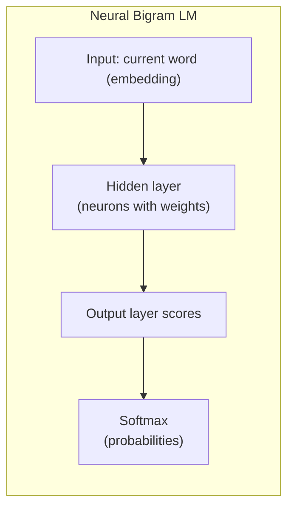

# Session 3: Introducing Neural Networks for Language Modeling

## Teaching Script

### Transition from N-grams

We've seen how counting word frequencies can give us a basic language model. Now, we're stepping up to a more powerful approach: using **Neural Networks** to model language. Why do we need this, and what can a neural network do that a simple lookup table of probabilities can't? Let's explore that step by step.

### Limitations Recap

Our N-gram (bigram) model had a **fixed context window** (just 1 word of history) and it couldn't generalize beyond what it saw. For example, if "astronaut launches" never appeared in training, the bigram model gave it zero probability, even though the model might have seen "astronaut" in other contexts and "launches" in other contexts. Ideally, we'd like a model that can infer or generalize that "astronaut" and "pilot" are somewhat related concepts (both are people who operate vehicles) and maybe give a chance to an unseen combination like "astronaut drives" if it has seen "pilot drives" or "astronaut flies". N-grams can't do this because they treat each word as an atomic symbol with no internal structure or relationships aside from direct neighbor counts. Neural networks, by contrast, can learn **continuous representations** for words (called *word embeddings*) that allow the model to capture similarity and patterns in a much more general way.

### Analogy – Why Continuous Representations

Think of how you might memorize the capitals of countries. A rote list (like an N-gram list) might have "France – Paris", "Spain – Madrid". If you never learned "Italy – Rome", you don't know it. But if you learned a pattern or had a map (analogy to an embedding space), you might infer that Italy's capital is likely something you heard in context with Italy (maybe you recall hearing "Rome" in context of Italy). Neural networks try to *learn* such patterns rather than memorizing every combination. They effectively map words into a high-dimensional space (imagine points in a multi-dimensional grid) where words with similar usage or meaning end up closer together. For instance, "cat" and "dog" might be near each other in this space, while "banana" is off in another region. This means the model could learn to treat "cat" and "dog" somewhat interchangeably in contexts where either could fit, even if one specific sequence wasn't in training, because their representations are similar.

### Neural Network Language Model – The Idea

A neural network is essentially a mathematical function with a bunch of adjustable parameters (weights). For language modeling, one classic approach (from Bengio et al. 2003) is:
- **Input:** a representation of the recent history (e.g., the last N-1 words).
- **Output:** a probability distribution over the next word.

Instead of storing explicit counts, we will **train** the network on examples (contexts and next-word outcomes) so that it *learns* to predict the next word for each context in the training data, and generalizes to contexts it has not seen exactly before.

### How to Feed Words into a Neural Network?

Neural networks work with numbers, specifically vectors/matrices of numbers. We need to convert words into numeric form. The simplest way:
- Assign each word in our vocabulary a unique index (like ID). For example, 0 = `<PAD>`, 1 = `<UNK>`, 2 = "the", 3 = "cat", 4 = "sat", etc.
- A naive numeric representation is a **one-hot vector**: a long vector as long as the vocabulary, filled with 0s, except a 1 at the position corresponding to the word's index. For instance, if "cat" is index 3 in a vocab of size 10, then "cat" one-hot = [0,0,0,1,0,0,0,0,0,0]. One-hot vectors allow us to represent categorical items in numeric form, but they are very large (length = vocab size, which could be tens of thousands or more) and don't by themselves provide a notion of similarity (all one-hots are equally distant from each other).
- A better way is to use an **embedding layer**: this is essentially a learned lookup table that maps each word index to a dense vector of, say, 50 or 100 dimensions. Initially, these vectors can be random, but during training, the network adjusts them such that words used in similar contexts end up with similar vectors. The embedding vector is like a compressed representation of a word's "meaning" or role. For now, know that an embedding is just a vector of numbers that we treat as the "neural representation" of a word.

So our plan: when the network sees a word (or a pair of words), it will input their embeddings (vectors) rather than using raw words.

### Structure of a Simple Neural LM

Consider the simplest case beyond a bigram: a **neural bigram model**. Instead of having a table of probabilities for "current word -> next word", we set up a tiny neural network:
- Input: one word (as an embedding vector).
- Some layers of computation (we'll detail in a second).
- Output: scores or probabilities for all possible next words.

For example, we might have an **input layer** of size equal to the embedding dimension (say 50). Then a small **hidden layer** (maybe 100 neurons) that combines information and applies a non-linear function (like ReLU or tanh – basically to introduce complexity so it's not just linear). Finally, an **output layer** that has as many neurons as our vocabulary size, which produces a score for each word being the next word. We then apply a softmax (a mathematical function that turns scores into probabilities that sum to 1). The highest probability word is the network's prediction for next word given the input.

If we only feed one word as input (like a bigram model), what's the benefit? Well, a neural network can in theory learn similar behavior to the bigram counts, but importantly, because of the embedding, if two words have similar contexts, their embeddings might be similar, and the network might assign similar next-word probabilities. For instance, if "cat" and "dog" embeddings end up near each other (because both appear in sentences like "the ___ chased the mouse" or "a ___ is a common pet"), then even if "chased" was seen after "dog" but not after "cat" in training, the network might still give a decent probability to "chased" after "cat" because it has learned that "cat" is semantically similar to "dog". This is **generalization** beyond seen data, something a pure count model can't do easily.

### Training the Neural Network

How do we get the network to output the right probabilities? We train it on our data by showing it many examples of (context -> next word). Initially, the network's weights (including the embeddings) are random, so it will output random predictions (basically garbage probabilities). We then perform the following loop (which is the essence of training via **gradient descent**):

1. Feed in an example (e.g., context: "the cat" -> next word: "sat"). The network computes an output distribution. Initially, it might say P("sat"|"the cat") = 0.01, P("ran") = 0.5, etc. (just random guesses).
2. Compare the output to the truth. The true next word is "sat", which we can represent as a one-hot vector (target probability 1 for "sat" and 0 for others). We calculate a **loss** function, typically cross-entropy, which basically measures how "off" the predicted distribution is from the target. If the network gave only 1% to "sat" but we needed 100% there, the loss is large.
3. Compute gradients of this loss with respect to all the network's weights (this is done by *backpropagation*, which is an algorithm that applies the chain rule of calculus through the network's functions to see how each weight contributed to the error).
4. Adjust the weights in the direction that reduces the loss (this is gradient descent: subtracting a small fraction of the gradient from each weight). After this step, the network is *slightly* better at predicting "sat" after "the cat" than it was before.
5. Repeat for lots of examples (essentially every adjacent pair or triple of words in the corpus is an example). Iterate over the data multiple times (epochs) until the network's predictions align well with the observed data probabilities.

Over time, the network learns useful patterns. For example, it might learn a representation where "the" as an input strongly activates outputs like nouns (because often after "the" comes a noun), or that after "I am", outputs like "happy/sad/going" have higher weight (learning the concept of first-person statements). This learning is not encoded by us manually; it happens through the weight adjustments automatically to reduce prediction errors.

### Why Neural Networks can be Powerful

- They can **smooth** probabilities: Even if a particular sequence wasn't seen, the network might give it a reasonable probability because it's similar to others. The model inherently does a kind of smoothing.
- They use a **fixed number of parameters** to generalize many combinations. An N-gram model parameter (count/probability) exists for each possible N-gram. A neural model might have fewer parameters than the total number of N-grams, but those parameters (like an embedding vector) are used to influence many combinations. For instance, with 10,000 words, a bigram model potentially tracks 100 million pairs (in worst case) whereas a neural model might use, say, 10,000 embeddings of 50 dimensions each (that's 500k parameters) plus some matrices. Those 500k parameters encode info that can apply to any pair dynamically, rather than storing each pair explicitly.
- They can incorporate **more context** easily: Instead of bigram, we could feed trigram (2 previous words) or 5 previous words into the network by just increasing input size or structure. The network can learn how to weigh those multiple inputs. We'll soon go to models that handle arbitrary-length context (RNNs), but even a fixed-window feedforward network can manage more context than an N-gram with the same N because it might implicitly learn to ignore irrelevant words and focus on important ones within that window.

### Simple Example to Illustrate Learning

Imagine a mini-vocabulary: {"I", "you", "run", "eat"}. And training sentences like "I run", "you run", "I eat". A bigram model from this would give P(run|I) = 0.5, P(eat|I) = 0.5 (since "I" is followed by run and eat equally), P(run|you) = 1, P(eat|you) = 0 (never saw "you eat"). Now a neural model might start random, but as it trains:
- It will create embeddings for "I" and "you". If the model notices "I" and "you" both lead to similar actions (run, eat vs run only, but both do "run"), it might place "I" and "you" somewhat close in embedding space so they both strongly connect to "run".
- After training, it might still give a low probability to "eat" after "you" if it never saw it (so it won't magically invent unseen pairs with high probability), but if "I" and "you" are close, it might give "eat|you" a tiny but non-zero probability (like maybe 0.1) because it learned a general idea that subjects can do multiple things. It won't be as zero-strict as the count model.
- More importantly, if later we fine-tune or see an example of "you eat", the network won't be starting from scratch for that pair; it already has an embedding for "you" that's similar to "I", and an output weight for "eat" associated with subjects, so it can learn it quickly.

We might not go deeper into the math of training right now, but conceptually think of training as **fitting a smooth curve** to a noisy set of points (where N-gram was like a step function that had no value for missing points). Neural nets try to fit a surface in a high-dimensional space that goes through all the (context -> next word) data points as best as possible, and in between those points it gives an interpolated value.

### Neural Network Anatomy in Simpler Terms

- **Layers:** Each layer of a neural network transforms the data. The first layer after inputs often does linear combination (weighted sum of inputs) plus a non-linear activation (like simulating a neuron firing threshold). This allows the network to learn complex functions, not just linear ones.
- **Hidden units:** These are like intermediate computations that aren't directly given or asked for, but the network learns to use them to represent important aspects of the input. In language, hidden units might end up representing things like "is this word plural?" or "does this context sound formal or casual?" without us explicitly telling it.
- **Output layer:** For language modeling, the output layer has one unit per word in the vocabulary. The value it produces (after softmax) is the predicted probability of that word being the next word. So if our vocab is 10000, the output is a 10000-dimensional vector of probabilities summing to 1.
- **Softmax:** This function ensures outputs are positive and sum to 1, essentially making them a valid probability distribution. It's defined as:
  $$\text{softmax}(z_i) = \frac{\exp(z_i)}{\sum_j \exp(z_j)}$$
  where $z_i$ are the raw scores from the network. The highest score becomes the highest probability, but everything is smoothed out exponentially.

### Jargon Watch

We introduced terms like **embedding**, **hidden layer**, **softmax**, **backpropagation**, **gradient descent**. These might sound complex, but their core ideas are:
- **Embedding:** a vector for each word (learned representation).
- **Hidden layer:** intermediate calculations that let the network model interactions (like combining information from input).
- **Softmax:** a way to convert arbitrary scores to probabilities.
- **Backpropagation:** the algorithm for tuning weights by seeing how wrong the output was and nudging weights in the right direction.
- **Gradient descent:** the overall optimization method of moving weights gradually to reduce error.

Don't worry if you can't do the calculus behind backpropagation in detail; conceptually understand that the network *learns from mistakes*. When it predicts something wrong, we adjust it to be more right next time. This is analogous to learning in humans: if you answer a quiz question wrong and then see the correct answer, you adjust your knowledge for the future.

### What's Next

In the next session, we'll actually write code for a simple neural network language model. We might start with a fixed-small-context model (like a neural bigram or trigram model) to demonstrate training. Then we'll progress to architectures that handle arbitrary-length context (**Recurrent Neural Networks** in Week 3). But grasping this basic neural network scenario is crucial: it's the building block for everything from here to large Transformers. Modern LLMs are essentially massive neural networks trained in this way (with more complex architecture and way more data), optimizing predictions of the next token.

---

## Presentation Slides

### Why Go Neural?

- N-gram models = memorize counts (no generalization beyond seen data).
- **Neural networks learn patterns:** they can handle unseen combinations better by understanding word similarities.
- They can use **continuous inputs (embeddings)** rather than discrete lookup tables, smoothing out the probability space.

### Word Embeddings

- Represent each word as a vector of numbers (e.g., 50-dimensional).
- Initially random, but learned during training.
- Words used in similar contexts get similar vectors (capturing notions of meaning/syntax).
- Example: After training, **"cat"** and **"dog"** might have vectors that are close together, whereas **"cat"** and **"bank"** would be far apart. This means the model knows cat and dog are related in usage (pets), but bank is different.

### Neural Network Structure (for Language Model)

- **Input layer:** Takes in embeddings of recent word(s). (If using 1-word context, input is that word's embedding; if 2-word context, could input both embeddings concatenated or processed.)
- **Hidden layer(s):** Neurons that combine inputs with weights and apply non-linear activation (e.g., ReLU, tanh). Think of this as a transformation that lets the network model interactions (e.g., combining "not" with "happy" to detect a negative sentiment in more advanced setups).
- **Output layer:** One neuron per vocabulary word. Produces a score for each possible next word. After softmax, these become probabilities.
- **Softmax function:** Ensures output probabilities sum to 1. It highlights the largest scores but still gives every word some nonzero probability.

### Visualization – Simple Neural Network LM (Bigram)

*Diagram: A single word embedding goes into a hidden layer, then to an output layer that predicts next-word probabilities.*

### Learning (Training the Network)

- Use many (context -> next word) examples from corpus.
- **Loss function:** measures error (e.g., high when the model gives low probability to the actual next word). Common choice: cross-entropy loss on the softmax output.
- **Backpropagation:** calculate how each weight contributed to error; compute gradients.
- **Gradient Descent:** adjust weights a little in the direction that reduces error. Repeat over many examples.
- Over time, network predictions align with training data frequencies, but with ability to generalize (no exact count for everything, but approximate).
- Essentially, **network "learns" the language patterns**: grammar, collocations, etc., encoded in its weights.

### Generalization Example

- Training data might not have "you eat", but has "I eat" and "you run". A good neural model might still give "eat" some probability after "you" because it learned "you" is similar to "I" (both pronouns) and "eat" is something a subject can do.
- The N-gram model would give "eat" zero probability after "you" (never seen). Neural nets assign a low but non-zero probability instead of an impossible 0 – more **forgiving** to unseen combos.

### Key Advantages

- **Uses distributed representation:** each word influences the model through its embedding, sharing statistical strength across many contexts.
- **Handles larger contexts:** We can feed more words into the network to consider longer histories (e.g., a 3-word window). We aren't as limited by combinatorial explosion because the network learns to compress that info in hidden layers.
- **Smoother probability space:** Similar contexts yield similar predictions, even if not identical to something seen. (E.g., model might know "dog barks" and thus assign some probability to "dogs bark" even if plural wasn't in training – because "dog" and "dogs" embeddings might be close, and grammar rules might be partially learned.)

### Terminology Simplified

- **Embedding:** numeric vector for a word (learned meaning).
- **Hidden layer:** intermediate calculation that lets model form abstract features (like a brain's hidden reasoning).
- **Activation function:** non-linear function (ReLU, sigmoid, tanh) applied at neurons so the network can model complex patterns, not just straight lines.
- **Backpropagation:** how the model figures out which weights to tweak – by propagating the output error backward through the network's layers.
- **Epoch:** one pass through the whole training dataset. We train for multiple epochs until performance stops improving.
- **Overfitting:** when a model memorizes training data (like an extreme N-gram) instead of generalizing. We combat this with techniques like regularization, but with enough data, neural nets generalize well.

### Setting the Stage for RNNs

- A fixed-window neural network can only see a limited number of words (like an N-gram with a smarter approach). How do we handle truly arbitrary length context?
- Preview: **Recurrent Neural Networks (RNNs)** allow a form of memory to process sequences of any length. They apply a neural network *recurrently* at each time step, carrying forward a state. That's our next topic.
- But first, we'll implement a small neural network LM to grasp how training works in code.
