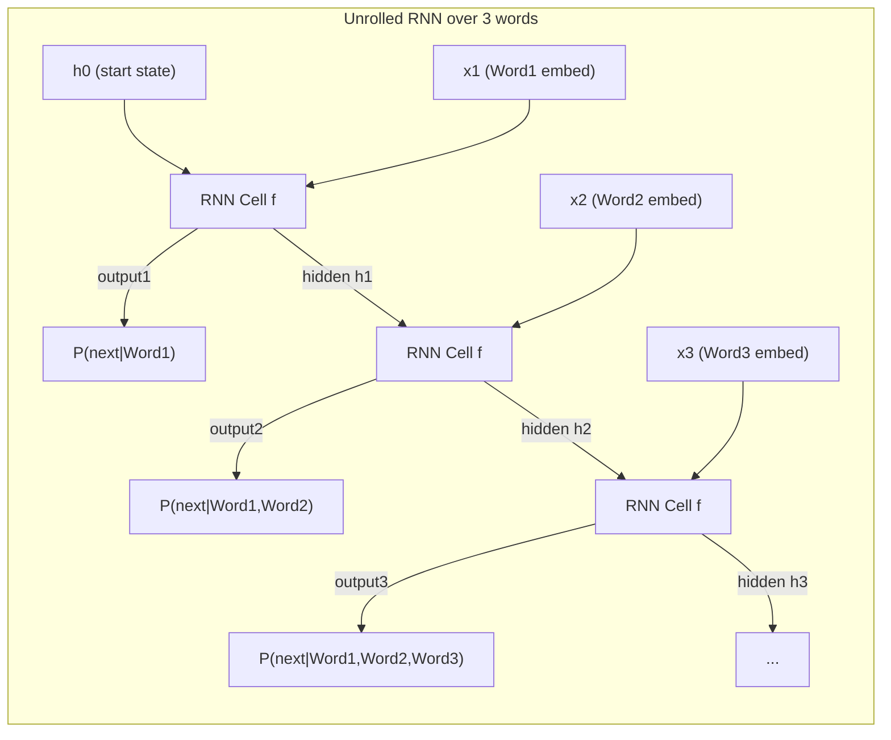

# Session 5: Sequences and Memory – Intro to RNNs

## Teaching Script

### The Need for Sequence Models

So far, our neural network language model took a fixed-size context (like 1 or 2 words) to predict the next word. But what if the context length isn't fixed or has important info far back? For example: "**The bird that sang a song at dawn** flew away." To predict "flew", the model might benefit from knowing the subject "bird" which is several words back. Fixed-window models can't look that far unless we artificially make the window huge. This is where **Recurrent Neural Networks (RNNs)** come in.

### What is an RNN?

A Recurrent Neural Network is a type of neural network designed to handle sequences of variable length by having a "memory" of past computations. The core idea is it processes sequence elements one by one, and at each step, it **updates a hidden state that carries information forward**. You can think of the hidden state as a summary or memory of everything seen so far (or at least, everything the network has deemed relevant).

Let's break down how a simple RNN works for language modeling:
- The RNN maintains a **hidden state vector** $h_t$ at time step $t$. This state is updated as new words come in.
- At each word (time step), the RNN takes two things as input: the current word (in vector form, e.g., embedding) and the previous hidden state $h_{t-1}$.
- It then computes a new hidden state:
  $$h_t = f(W_x \cdot x_t + W_h \cdot h_{t-1} + b)$$
  where:
  - $x_t$ is the input at time $t$ (e.g., embedding of current word)
  - $W_x$ and $W_h$ are weight matrices (for input-to-hidden and hidden-to-hidden connections)
  - $b$ is a bias vector
  - $f$ is a non-linear activation function (often tanh or ReLU)
- Simultaneously (or afterwards), it can compute an **output** (like probabilities for next word) from $h_t$ via another set of weights:
  $$y_t = \text{softmax}(W_y \cdot h_t)$$
  In a language model, we might align this such that $y_t$ represents P(next word at step $t$ | all words up to step $t$).

Crucially, the hidden state $h_t$ acts as the "memory" that gets passed along. Initially, at the start of a sequence, we can initialize $h_0$ to a zero vector (or some learned start state). As we feed words one by one, $h_t$ hopefully encodes useful info about the sequence up to that point.

### Analogy

Think of reading a sentence like how *you* process words: you read one word at a time and update your understanding. For instance, reading "The bird that sang..." – by the time you reach "flew", you have a mental representation that the subject is "bird", even though "bird" was many words ago. An RNN is trying to mimic this: it carries forward a representation (hidden state) that can hold the concept "the subject is bird and it did some singing". When it gets to where it must predict "flew", the hidden state hopefully contains that a "bird" is the subject (and birds can fly), so it leans toward "flew" or some flight-related verb. A fixed-window model looking only at, say, "dawn flew" might not realize it's the bird doing the action.

### Unrolling in Time

When we draw an RNN, we often show it as one cell with a loop arrow to itself (indicating recurrence). To visualize it in action, we "unroll" this loop across time steps:

```
Word1 -> [RNN cell] -> output1 (and h1)
          ^ (h0)
Word2 -> [RNN cell] -> output2 (and h2)
          ^ (h1)
Word3 -> [RNN cell] -> output3 (and h3)
          ^ (h2)
... and so on.
```

Each [RNN cell] in the unrolled view is essentially the same network repeated (same weights $W_x, W_h, W_y$), but it's applied sequentially. The arrow feeding upward represents the hidden state being passed to the next step.

### Mathematics (light)

One simple RNN formulation:
- $h_t = \tanh(W_x \cdot x_t + W_h \cdot h_{t-1} + b_h)$
  (We use tanh as activation, so values stay between -1 and 1, which helps stability.)
- $o_t = W_y \cdot h_t + b_y$
  (These are the logits or scores for output)
- Then $P(\text{word} | \text{context up to } t) = \text{softmax}(o_t)$

All the W's and b's are learned parameters. Notice $W_h \cdot h_{t-1}$ means the previous hidden state is linearly transformed and added to the input's effect. This is how past info influences the present.

### Training an RNN for Language Modeling

We would train it similarly to before, but now the model sees full sequences. For a given sentence, we feed it words one by one, and at each step we can ask it to predict the *next word*. This gives a series of predictions. We can compute loss at each time step (like cross-entropy with the actual next word) and sum (or average) these losses. Then backpropagation happens **through time** (BPTT: backpropagation through time), meaning the gradient flows not only through the network at a single step, but backward through those recurrent connections across time steps. In practice, one might truncate the sequence for efficiency (like consider up to k steps back for gradient), but conceptually, it can propagate from the end of a sequence all the way to the beginning, adjusting weights so that the hidden states carry the right info to make good predictions.

### RNN's Strength

- **Flexible context length:** It can, in theory, use information from many time steps ago, not just a fixed window. If the sequence is 50 words long, the hidden state after 50 words can (in theory) contain info from all 50 words.
- **Shared parameters across time:** It doesn't blow up parameters with longer context, since it reuses the same weights at each step. So it's generalizing the concept of "how to combine a new word with previous state" to any position in the sequence.
- **Variable length handling:** You can feed it sequences of different lengths one by one. The computation naturally runs until the sequence ends (e.g., at an `<END>` token).

### Challenges with RNNs

While powerful, basic RNNs had issues:
- **Vanishing/exploding gradients:** When trying to learn long-term dependencies (like something 20 steps back), the gradients either get very small (vanish) or can blow up exponentially. This made it hard for basic RNNs to actually learn to preserve info for many steps. In practice, they tended to "forget" things after a short context (some say ~10 words effectively). This is why more advanced variants like LSTM (Long Short-Term Memory) were invented – to explicitly address keeping long-term info.
- **Training time:** RNNs can be slower to train because you can't fully parallelize the time steps (each depends on the previous), unlike a feed-forward network where all examples are independent.

But despite these, RNNs were a breakthrough as they were the first tool that allowed *learning* from sequential data in a flexible way.

### Example to Illustrate RNN Memory

Consider these two sentences:
1. "I grew up in France and I speak fluent **French**."
2. "I grew up in France and I speak fluent **German**."

A language model should give higher probability to "French" in the first because France implies French language. A basic RNN could capture this: when it reads "France", it might encode something in the hidden state like "country=France". Later when predicting the language, if the network is capable, it will use that hidden state to bias towards "French". If the context is long with many words in between, a simple RNN might struggle to carry that info through all the intermediate words (that's the long-term dependency problem). But an LSTM (coming next session) is designed to handle that better by essentially having a more explicit memory with gates.

### RNN vs Feed-forward LM (difference recap)

- Feed-forward with fixed window sees (for example) the last 3 words and that's it. If the crucial clue was 5 words ago, tough luck.
- RNN processes all prior words one by one. By the time it's at word t, it's seen the last t-1 words and potentially encoded aspects of them in $h_{t-1}$.
- So RNN is conceptually looking at the entire prefix of the sequence, not a limited window. It's not guaranteed to *remember* all of it well (due to capacity or vanishing gradients), but at least the architecture allows it.

### Using an RNN for Generation

Once an RNN LM is trained, you can generate text by feeding in a start (like a special `<START>` token or just begin with hidden state = 0 and give it some starting word). Then sample the next word from P(y₁|x₁), feed that word back in as the next input, and repeat. It's similar to how we did with bigram, but now the model's decision at each step is informed by potentially the whole history so far via the hidden state. In practice, RNN generation yields more coherent sentences than pure bigram because it can enforce consistency better (e.g., not change topic every two words, ideally).

### Wrap-up

RNNs are a foundation for understanding more sophisticated sequence models. They introduce the notion of **stateful processing** of sequences – the network has a state that evolves. Understanding RNNs is necessary to then appreciate improvements like LSTMs (which fix the memory issue) and ultimately Transformers (which take a different approach to sequence modeling with attention).

---

## Presentation Slides

### What is a Recurrent Neural Network (RNN)?

- A neural network designed to handle sequences of **arbitrary length** by maintaining a **hidden state (memory)** that gets updated at each step.
- Processes input one element at a time, **reusing the same network** for each time step (so it generalizes across positions).

### RNN as "unrolled" over time

- Each time step: takes previous hidden state $h_{t-1}$ and current input $x_t$ (current word's embedding), produces new state $h_t$.
- Also produces an output (like next-word probabilities) at each step.



*Diagram:* The same "RNN Cell f" is used at each time. Each takes the previous hidden state and current word vector, outputs a new hidden state and a prediction.

### Hidden State = Memory

- $h_t = f(h_{t-1}, x_t)$. Think of $h_t$ as summarizing "everything important from word1 up to word t".
- It's a fixed-size vector (e.g., 100 dims) regardless of sequence length – so it's a **compressed representation** of potentially a lot of info. The network learns what to store there.
- At start, $h_0$ is typically a zero vector or learned initial state.

### How RNN updates (formula)

- Example: $h_t = \tanh(W_x \cdot x_t + W_h \cdot h_{t-1} + b)$
- $W_x$: weights for current input, $W_h$: weights for previous state.
- The tanh (or ReLU) adds non-linearity. Without it, the RNN would just be linear and not very powerful.
- The same $W_x, W_h, b$ are used for every time step (parameter sharing).

### Prediction and Training

- Output at time $t$: $y_t = \text{softmax}(W_y \cdot h_t)$ gives probabilities for next word at that position.
- Training uses **Backpropagation Through Time (BPTT)**: Unroll the RNN for the length of the sequence, compute loss at each step (comparing $y_t$ to actual next word), sum up, and backpropagate gradients through the unrolled network.
- Because of this chain, long sequences cause gradients to multiply many times → can **vanish or explode**, making it hard to learn very long-term dependencies.

### RNN Advantages

- **Context Flexibility:** Can utilize information from far back in the sequence (not limited to N-1 words).
- **One model for all positions:** Learns a general rule for "how to combine previous context with new input" that applies to any time step. Efficient in parameters.
- **Online prediction:** It can process sequences incrementally. For generation, you can feed the last output as next input easily.

### Practical Limits of Basic RNNs

- Tends to have **short-term memory** only (like it might effectively use only the last ~5-10 words) due to vanishing gradients. Struggles with long-term dependencies (e.g., remembering a name mentioned 20 words earlier).
- **Long Short-Term Memory (LSTM)** networks were invented to combat this by adding gating mechanisms. (Teaser: LSTMs maintain a more constant error flow so they can remember info over 100+ time steps by design.)
- **Sequential processing = slower** (can't fully parallelize like Transformers can, as we'll later see). But for a long time, RNNs were the go-to for sequential tasks.

### Use Cases of RNN (historical)

- Language Modeling (predicting next word/character given history).
- Machine Translation (an RNN "encoder" reads a sentence, then an RNN "decoder" generates translation – prevalent before Transformers).
- Speech Recognition, Time-series prediction, Music generation – anywhere data is sequential.

### Example Insight

- If training on English text, an RNN might learn to keep track of whether the current clause subject is singular or plural, so it can choose "is" vs "are" later. Or remember if we are inside a quotation, etc.
- It's not explicitly told these rules; it implicitly learns some by storing relevant info in $h_t$. LSTMs made this more robust by explicitly controlling what to keep/forget.

---

## Quiz / Exercises

### 1. Understanding Hidden State
In your own words, explain what the hidden state $h_t$ represents in an RNN. Why is it useful for language modeling?

**Answer:** The hidden state $h_t$ is a vector that acts as the RNN's "memory" – it's a compressed summary of all the information the network has seen so far in the sequence (from word 1 up to word t). It's useful for language modeling because it allows the model to consider context beyond just the immediately previous word. The hidden state can encode things like the subject of a sentence, the topic being discussed, whether we're inside a quote, etc. This information can then influence predictions about what word comes next, enabling more coherent text generation than fixed-window models.

### 2. RNN vs Fixed-Window
A fixed-window neural network with window size 3 looks at the last 3 words. An RNN processes words one by one with a hidden state. What happens if important context is 5 words back? Compare how each model handles this.

**Answer:** 
- **Fixed-window (size 3):** Cannot directly see or use information from 5 words back – it's outside the window. The model is blind to that context, no matter how important it is. It would have to guess based only on the last 3 words.
- **RNN:** When it processed the important word 5 steps ago, it updated the hidden state to (hopefully) include relevant information. That information is then carried forward through all subsequent steps. By the time we're 5 words later, the hidden state still contains some representation of that earlier context (though it may be degraded due to vanishing gradients). The RNN at least has a *mechanism* to use distant information, even if imperfectly.

### 3. Vanishing Gradient Thought
If you made an RNN read a 100-word sentence and then asked it to recall the very first word, why is this hard for a basic RNN?

**Answer:** Because of the **vanishing gradient problem**. As the RNN processes 100 words, the influence of the first word on the hidden state tends to diminish with each step, especially if there's no reinforcement of that info later. When training, the error signal that would adjust weights to remember word1 until the end has to backpropagate through 100 time steps. At each step, gradients can get multiplied by factors (like derivative of tanh etc.), often < 1, causing them to shrink exponentially as they go back through 100 steps. By the time they reach weights related to word1, they're almost zero – meaning the model doesn't learn to preserve that info. So the network effectively "forgets" or can't carry specific info for that long. Without special mechanisms, it's hard for a basic RNN to carry something unchanged for 100 steps.

### 4. Practical Application
Consider the phrase: "The cat, which had been sleeping on the mat all afternoon, suddenly **woke** up." A bigram model might predict "sat" or something weird after "suddenly" because it only sees "suddenly ___". How could an RNN handle this better?

**Answer:** An RNN will process the whole sentence up to "suddenly", carrying along context. In this sentence, the subject "cat" and the verb "had been sleeping" are earlier. By the time it gets to "suddenly ___ up", the RNN's hidden state could contain the information that the cat was sleeping, so something related to waking is likely. The word "suddenly" alone doesn't tell you what comes after (bigram might guess randomly), but the RNN's memory includes that the cat had been sleeping. So an RNN has a chance to correctly predict "woke" because it knows the cat was asleep (so waking is a logical next event). Essentially, the RNN uses long-range dependency: it remembers the cat's state (sleeping) and when "suddenly" arrives, it can combine that knowledge to predict "woke".

### 5. Looking Forward
We mentioned LSTMs help with long-term memory. Based on what you know about the vanishing gradient problem, what do you think LSTMs might do differently? (Just speculation based on what we've learned.)

**Answer:** LSTMs probably have some mechanism to prevent gradients from vanishing over many steps. They might:
- Have a way to pass information more directly without as many transformations that shrink gradients
- Include "gates" that can decide what information to keep or throw away, rather than always mixing everything together
- Maintain a separate "memory cell" that can hold information without constant modification

(This is indeed what LSTMs do – they have a cell state that can carry information unchanged, plus input/forget/output gates that regulate information flow. We'll learn the details in the next session!)
