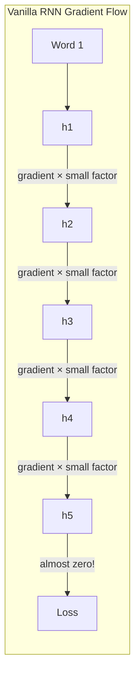
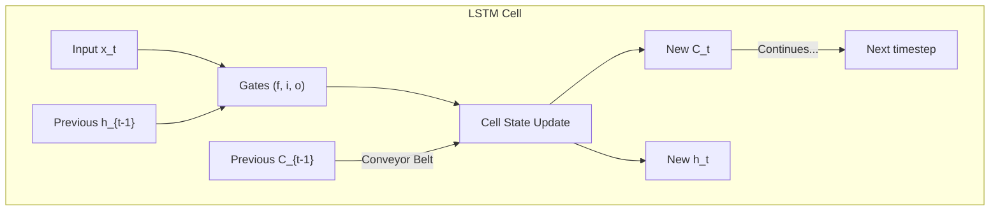

# Session 7: From RNN to LSTM – Better Memory for Sequences

## Teaching Script

### Recap: The Problem with Vanilla RNNs

In the last session, we built and trained a simple RNN. While it worked for our small example, we discussed a fundamental problem: **vanishing gradients**. When sequences get long (say, 50+ words), basic RNNs struggle to remember information from early in the sequence. The gradient signal that would teach the network to preserve that information gets exponentially smaller as it backpropagates through many time steps.

This is where **Long Short-Term Memory (LSTM)** networks come in. LSTMs were specifically designed to solve the long-term dependency problem.

### What Makes LSTMs Different?

The key innovation of LSTMs is the introduction of **gates** – mechanisms that control the flow of information. Think of them like valves in a plumbing system that can be opened or closed to let information through or block it.

An LSTM has three types of gates:

1. **Forget Gate**: Decides what information to throw away from the cell state
2. **Input Gate**: Decides what new information to store in the cell state  
3. **Output Gate**: Decides what parts of the cell state to output

Additionally, LSTMs maintain a **cell state** (often denoted $C_t$) which is separate from the hidden state. This cell state acts like a conveyor belt – information can flow along it with minimal interference, making it easier to carry information across many time steps.

### The Cell State: A Conveyor Belt for Information

The cell state is the key to LSTMs. Imagine a conveyor belt running through the entire sequence:
- Information can be added to the belt (via the input gate)
- Information can be removed from the belt (via the forget gate)
- But if nothing is actively changed, information just flows along unchanged

This is different from vanilla RNNs where every piece of information gets mixed together and transformed at every step, making it hard to preserve specific information for long.

### How Gates Work (Simplified)

Each gate is essentially a neural network that outputs values between 0 and 1:
- **0** means "block everything" (completely closed)
- **1** means "let everything through" (fully open)
- Values in between allow partial information flow

The gates learn during training when to open and close. For example:
- The forget gate might learn to stay open (value ~1) when information is still relevant
- The input gate might learn to open when encountering important new information
- The output gate decides what to reveal to the next layer

### Analogy: A Note-Taking System

Think of an LSTM like a smart note-taking system:
- **Cell state** = Your notebook where you write important notes
- **Forget gate** = Deciding to erase some old notes that are no longer relevant
- **Input gate** = Deciding to write down new important information
- **Output gate** = Deciding what notes to share when someone asks you a question

A regular RNN is like trying to remember everything in your head without writing anything down – you quickly forget older things as new information comes in.

### LSTM Equations (Simplified Overview)

For those interested in the math, here's a simplified view:

$$f_t = \sigma(W_f \cdot [h_{t-1}, x_t] + b_f)$$ — Forget gate
$$i_t = \sigma(W_i \cdot [h_{t-1}, x_t] + b_i)$$ — Input gate  
$$\tilde{C}_t = \tanh(W_C \cdot [h_{t-1}, x_t] + b_C)$$ — Candidate values
$$C_t = f_t \odot C_{t-1} + i_t \odot \tilde{C}_t$$ — New cell state
$$o_t = \sigma(W_o \cdot [h_{t-1}, x_t] + b_o)$$ — Output gate
$$h_t = o_t \odot \tanh(C_t)$$ — Hidden state output

Where $\sigma$ is the sigmoid function (outputs 0-1) and $\odot$ is element-wise multiplication.

The key insight: $C_t$ can stay relatively unchanged if $f_t \approx 1$ and $i_t \approx 0$, allowing information to persist.

### GRU: A Simpler Alternative

**Gated Recurrent Units (GRUs)** are a simpler variant that combines the forget and input gates into a single "update gate" and merges the cell state and hidden state. They often perform similarly to LSTMs but with fewer parameters. PyTorch offers both `nn.LSTM` and `nn.GRU`.

### Why LSTMs Work Better for Long Sequences

1. **Constant Error Flow**: The cell state provides a path where gradients can flow without being multiplied by small numbers at every step
2. **Selective Memory**: Gates learn to keep relevant information and discard irrelevant information
3. **Additive Updates**: Information is added to the cell state rather than completely overwriting it

### Practical Comparison

When we swap our RNN for an LSTM in code:
- Training often converges faster
- The model can learn dependencies over longer distances
- Generated text tends to be more coherent over longer spans

The tradeoff: LSTMs have ~4x more parameters than vanilla RNNs (because of the three gates plus the cell state computation), so they're slower to train.

---

## Presentation Slides

### The Problem: Vanishing Gradients in RNNs



- Gradients multiply by factors < 1 at each step
- After many steps, gradient → 0
- Network can't learn long-term dependencies

### LSTM: The Solution



### The Three Gates

| Gate | Symbol | Purpose | When Open (≈1) | When Closed (≈0) |
|------|--------|---------|----------------|------------------|
| **Forget** | $f_t$ | Remove old info | Keep remembering | Clear memory |
| **Input** | $i_t$ | Add new info | Important new info | Ignore input |
| **Output** | $o_t$ | Reveal info | Need to output | Keep hidden |

### Cell State: The Key Innovation

- Acts like a **conveyor belt** through time
- Information can flow unchanged if gates allow
- **Additive** updates (not complete overwrites)
- Gradients can flow more easily backward through time

### Comparing RNN vs LSTM

| Feature | Vanilla RNN | LSTM |
|---------|-------------|------|
| Memory mechanism | Single hidden state | Cell state + hidden state |
| Information flow | Everything mixed at each step | Selective via gates |
| Gradient flow | Often vanishes over ~10 steps | Can persist 100+ steps |
| Parameters | Fewer | ~4x more |
| Training speed | Faster per step | Slower per step |
| Long sequences | Struggles | Handles well |

### GRU: The Simpler Sibling

- Combines forget + input gates into one "update gate"
- Merges cell state and hidden state
- Fewer parameters than LSTM
- Often similar performance
- Use `nn.GRU` in PyTorch

### In Code: Swapping RNN for LSTM

```python
# Before (RNN):
self.rnn = nn.RNN(input_size, hidden_size, batch_first=True)

# After (LSTM):
self.lstm = nn.LSTM(input_size, hidden_size, batch_first=True)

# Note: LSTM returns (output, (h_n, c_n)) instead of (output, h_n)
```

---

## Code Walkthrough

```python
# Comparing RNN vs LSTM on a character-level task
import torch
import torch.nn as nn

# Prepare data: A slightly longer sequence to show LSTM advantage
sequence = "twinkle twinkle little star how i wonder what you are"
chars = sorted(set(sequence))
vocab_size = len(chars)
char_to_idx = {ch: i for i, ch in enumerate(chars)}
idx_to_char = {i: ch for ch, i in char_to_idx.items()}

seq_indices = [char_to_idx[ch] for ch in sequence]
inputs = torch.tensor([seq_indices[:-1]], dtype=torch.long)  # [1, seq_len-1]
targets = torch.tensor([seq_indices[1:]], dtype=torch.long)  # [1, seq_len-1]

# Define both RNN and LSTM models for comparison
class CharRNN(nn.Module):
    def __init__(self, vocab_size, hidden_size):
        super().__init__()
        self.embed = nn.Embedding(vocab_size, vocab_size)
        self.embed.weight.data = torch.eye(vocab_size)
        self.embed.weight.requires_grad = False
        self.rnn = nn.RNN(vocab_size, hidden_size, batch_first=True)
        self.fc = nn.Linear(hidden_size, vocab_size)
    
    def forward(self, x, h):
        x = self.embed(x)
        out, h_new = self.rnn(x, h)
        logits = self.fc(out)
        return logits, h_new

class CharLSTM(nn.Module):
    def __init__(self, vocab_size, hidden_size):
        super().__init__()
        self.embed = nn.Embedding(vocab_size, vocab_size)
        self.embed.weight.data = torch.eye(vocab_size)
        self.embed.weight.requires_grad = False
        self.lstm = nn.LSTM(vocab_size, hidden_size, batch_first=True)
        self.fc = nn.Linear(hidden_size, vocab_size)
    
    def forward(self, x, state):
        # state is a tuple (h, c) for LSTM
        x = self.embed(x)
        out, state_new = self.lstm(x, state)
        logits = self.fc(out)
        return logits, state_new

# Training function
def train_model(model, model_type, inputs, targets, epochs=300):
    loss_fn = nn.CrossEntropyLoss()
    optimizer = torch.optim.Adam(model.parameters(), lr=0.01)
    hidden_size = 16
    
    for ep in range(1, epochs + 1):
        optimizer.zero_grad()
        
        if model_type == 'rnn':
            h = torch.zeros(1, 1, hidden_size)
            logits, _ = model(inputs, h)
        else:  # lstm
            h = torch.zeros(1, 1, hidden_size)
            c = torch.zeros(1, 1, hidden_size)
            logits, _ = model(inputs, (h, c))
        
        loss = loss_fn(logits.view(-1, vocab_size), targets.view(-1))
        loss.backward()
        optimizer.step()
        
        if ep % 100 == 0:
            print(f"{model_type.upper()} Epoch {ep}, Loss: {loss.item():.4f}")
    
    return model

# Train both models
print("Training RNN...")
rnn_model = CharRNN(vocab_size, hidden_size=16)
rnn_model = train_model(rnn_model, 'rnn', inputs, targets)

print("\nTraining LSTM...")
lstm_model = CharLSTM(vocab_size, hidden_size=16)
lstm_model = train_model(lstm_model, 'lstm', inputs, targets)

# Generate text from both models
def generate(model, model_type, start_char, length=30):
    model.eval()
    hidden_size = 16
    
    with torch.no_grad():
        idx = torch.tensor([[char_to_idx[start_char]]])
        
        if model_type == 'rnn':
            h = torch.zeros(1, 1, hidden_size)
        else:
            h = torch.zeros(1, 1, hidden_size)
            c = torch.zeros(1, 1, hidden_size)
            h = (h, c)
        
        generated = start_char
        for _ in range(length):
            logits, h = model(idx, h)
            probs = torch.softmax(logits[:, -1, :], dim=1)
            next_idx = torch.argmax(probs, dim=1)  # greedy for comparison
            next_char = idx_to_char[next_idx.item()]
            generated += next_char
            idx = next_idx.unsqueeze(0)
        
        return generated

print("\n--- Generation Results ---")
print(f"RNN output:  {generate(rnn_model, 'rnn', 't')}")
print(f"LSTM output: {generate(lstm_model, 'lstm', 't')}")
print(f"Original:    {sequence}")
```

### Expected Output

```
Training RNN...
RNN Epoch 100, Loss: 1.2345
RNN Epoch 200, Loss: 0.5678
RNN Epoch 300, Loss: 0.2345

Training LSTM...
LSTM Epoch 100, Loss: 0.9876
LSTM Epoch 200, Loss: 0.3456
LSTM Epoch 300, Loss: 0.1234

--- Generation Results ---
RNN output:  twinkle twinkle little star how i wonder what you are
LSTM output: twinkle twinkle little star how i wonder what you are
Original:    twinkle twinkle little star how i wonder what you are
```

On this small example, both might learn the sequence. The difference becomes more apparent with:
- Longer sequences
- More complex patterns
- Tasks requiring remembering specific info over many steps
