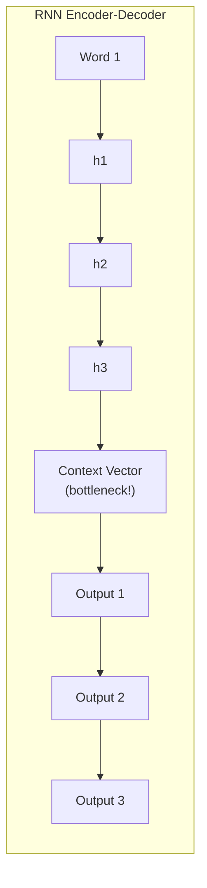
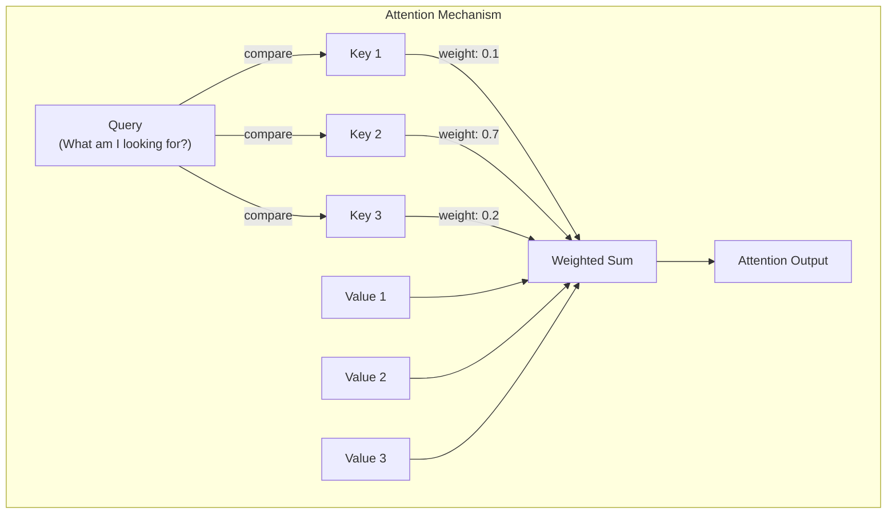
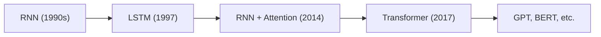

# Session 8: Introduction to Attention Mechanisms

## Teaching Script

### Why Do We Need Attention?

Even LSTMs have limitations. Imagine trying to translate a long sentence from English to French. The entire meaning of the English sentence has to be compressed into a single hidden state (or cell state) before the decoder starts generating French words. This is like trying to remember a whole paragraph by creating one mental summary – you inevitably lose details.

**Attention** solves this by allowing the model to "look back" at all previous positions when making a prediction, rather than relying solely on a compressed summary.

### The Core Intuition

When you read a question like "The cat sat on the mat. What did the cat sit on?", you don't process all the words equally. Your attention naturally focuses on "mat" when answering the question. Neural attention mechanisms mimic this selective focus.

The key insight: **not all context is equally important for every prediction**. Attention lets the model dynamically weight which parts of the input to focus on.

### Query, Key, and Value – The QKV Framework

Attention mechanisms typically use three concepts:

1. **Query (Q)**: "What am I looking for?"
   - The current position's representation asking a question
   
2. **Key (K)**: "What do I contain?"
   - Each position's representation advertising what information it holds

3. **Value (V)**: "What information can I provide?"
   - The actual content to be retrieved

The process:
1. Compare the Query to all Keys (compute similarity scores)
2. Convert scores to weights using softmax (weights sum to 1)
3. Compute weighted sum of Values

### A Concrete Analogy: Library Search

Imagine searching for books in a library:
- **Query**: Your search terms ("books about cooking")
- **Keys**: The labels/tags on each book ("cooking", "history", "science", etc.)
- **Values**: The actual content of each book

The attention mechanism:
1. Compares your search (Query) to all labels (Keys)
2. Finds the most relevant matches (high similarity scores)
3. Returns a weighted combination of the book contents (Values)

### Mathematical Formulation

For a sequence of hidden states $H = [h_1, h_2, ..., h_n]$:

$$\text{score}(q, k_i) = q \cdot k_i$$ — Dot product similarity

$$\text{weights} = \text{softmax}(\text{scores})$$ — Normalize to sum to 1

$$\text{output} = \sum_i \text{weight}_i \cdot v_i$$ — Weighted sum of values

In the simple case where Q, K, V are all the same (self-attention):
$$\text{Attention}(H) = \text{softmax}(H \cdot H^T) \cdot H$$

### Scaled Dot-Product Attention

When the dimension of the vectors is large, dot products can become very large, pushing softmax into regions with tiny gradients. The solution is to scale:

$$\text{Attention}(Q, K, V) = \text{softmax}\left(\frac{QK^T}{\sqrt{d_k}}\right)V$$

Where $d_k$ is the dimension of the key vectors. The $\sqrt{d_k}$ scaling keeps the values in a reasonable range.

### Self-Attention: Every Position Attends to Every Position

In **self-attention**, each position in a sequence computes attention over all positions (including itself). This lets the model learn relationships between any pair of positions, regardless of distance.

For example, in "The cat that was sitting on the mat was black":
- The word "black" can directly attend to "cat" even though they're far apart
- No need to pass information through multiple RNN steps

### Causal (Masked) Attention for Language Models

For language models, we can't let a word "peek" at future words during training. We use a **causal mask** that blocks attention to future positions:

```
Position:  1    2    3    4    5
     1:    ✓    ✗    ✗    ✗    ✗
     2:    ✓    ✓    ✗    ✗    ✗
     3:    ✓    ✓    ✓    ✗    ✗
     4:    ✓    ✓    ✓    ✓    ✗
     5:    ✓    ✓    ✓    ✓    ✓
```

Each row can only attend to positions ≤ its own position.

### Benefits of Attention

1. **Long-range dependencies**: Direct connections between any two positions
2. **Parallelization**: Unlike RNNs, attention can process all positions simultaneously
3. **Interpretability**: Attention weights show what the model "looks at"
4. **No vanishing gradient over distance**: Gradients flow directly between connected positions

### From RNN+Attention to Transformers

Originally, attention was added to RNN encoder-decoder models (like for translation). The breakthrough of the **Transformer** was realizing that you can build powerful models using **only attention** – no RNNs needed! This is the architecture behind GPT, BERT, and most modern LLMs.

---

## Presentation Slides

### The Bottleneck Problem



**Problem**: Entire input compressed into single vector → Information loss!

### Attention: Look Back at Everything



### Query-Key-Value (QKV)

| Component | Analogy | Role |
|-----------|---------|------|
| **Query (Q)** | Search terms | "What am I looking for?" |
| **Key (K)** | Book labels | "What information do I contain?" |
| **Value (V)** | Book content | "Here's my actual information" |

**Process:**
1. Score = Query · Key (dot product)
2. Weights = softmax(Scores)
3. Output = Σ(Weight × Value)

### The Attention Formula

$$\text{Attention}(Q, K, V) = \text{softmax}\left(\frac{QK^T}{\sqrt{d_k}}\right)V$$

- $QK^T$: How similar is each query to each key?
- $\sqrt{d_k}$: Scale factor to keep values reasonable
- softmax: Convert scores to probabilities (sum to 1)
- Multiply by $V$: Get weighted combination of values

### Self-Attention Visualization

Input: "The cat sat on mat"

| Query Position | Attends Most To | Why |
|----------------|-----------------|-----|
| "sat" | "cat" | Subject of the verb |
| "on" | "mat" | Preposition links to object |
| "mat" | "The", "on" | Article and preposition |

Every position can attend to every other position directly!

### Causal Mask for Language Models

```
       Position 1  Position 2  Position 3  Position 4
Pos 1:     ✓           ✗           ✗           ✗
Pos 2:     ✓           ✓           ✗           ✗
Pos 3:     ✓           ✓           ✓           ✗
Pos 4:     ✓           ✓           ✓           ✓
```

- ✓ = Can attend (score used)
- ✗ = Cannot attend (score set to -∞ before softmax)

**Purpose**: Prevents "cheating" by looking at future tokens

### Attention vs RNN

| Feature | RNN | Attention |
|---------|-----|-----------|
| Long-range connections | Indirect (through many steps) | Direct |
| Parallelization | Sequential (slow) | Parallel (fast) |
| Gradient flow | Can vanish | Direct paths |
| Computation | O(n) sequential steps | O(n²) parallel ops |

### The Path to Transformers



**Key insight**: We can build models with ONLY attention – no RNN needed!

---

## Code Walkthrough

```python
# Simple Self-Attention Implementation
import torch
import torch.nn as nn
import torch.nn.functional as F

def simple_self_attention(x):
    """
    Simplest self-attention: Q=K=V=x
    x: (batch, seq_len, embed_dim)
    """
    # Compute attention scores: how similar is each position to each other?
    # scores[i,j] = dot(x[i], x[j])
    scores = torch.matmul(x, x.transpose(-2, -1))  # (batch, seq_len, seq_len)
    
    # Scale by sqrt(d) to prevent large values
    d_k = x.size(-1)
    scores = scores / (d_k ** 0.5)
    
    # Convert to probabilities with softmax
    weights = F.softmax(scores, dim=-1)  # (batch, seq_len, seq_len)
    
    # Weighted sum of values (which is x itself in simple self-attention)
    output = torch.matmul(weights, x)  # (batch, seq_len, embed_dim)
    
    return output, weights

# Example usage
torch.manual_seed(42)

# Create a simple sequence: 3 positions, 4-dimensional embeddings
# Imagine this represents: ["the", "cat", "sat"]
x = torch.randn(1, 3, 4)  # (batch=1, seq_len=3, embed_dim=4)

print("Input shape:", x.shape)
print("Input:\n", x)

output, attention_weights = simple_self_attention(x)

print("\nAttention weights (each row sums to 1):")
print(attention_weights)
print("\nRow sums:", attention_weights.sum(dim=-1))

print("\nOutput shape:", output.shape)
print("Output:\n", output)
```

### Adding Causal Masking

```python
def causal_self_attention(x):
    """
    Self-attention with causal mask (for language modeling)
    Position i can only attend to positions <= i
    """
    batch, seq_len, d_k = x.shape
    
    # Compute attention scores
    scores = torch.matmul(x, x.transpose(-2, -1)) / (d_k ** 0.5)
    
    # Create causal mask: lower triangular matrix
    # True = keep, False = mask out
    mask = torch.tril(torch.ones(seq_len, seq_len, dtype=torch.bool))
    
    # Apply mask: set masked positions to -infinity
    # After softmax, -inf becomes 0
    scores = scores.masked_fill(~mask, float('-inf'))
    
    print("Scores after masking:\n", scores)
    
    # Softmax (masked positions become 0)
    weights = F.softmax(scores, dim=-1)
    
    # Weighted sum
    output = torch.matmul(weights, x)
    
    return output, weights

print("\n" + "="*50)
print("CAUSAL SELF-ATTENTION")
print("="*50)

output, attention_weights = causal_self_attention(x)

print("\nCausal attention weights:")
print(attention_weights)
print("\nNote: Position 0 only attends to itself")
print("      Position 1 attends to positions 0 and 1")
print("      Position 2 attends to positions 0, 1, and 2")
```

### Attention with Learned Q, K, V Projections

```python
class SelfAttention(nn.Module):
    """
    Full self-attention with learned Q, K, V projections
    """
    def __init__(self, embed_dim):
        super().__init__()
        self.embed_dim = embed_dim
        
        # Learned projections: transform input into Q, K, V
        self.W_q = nn.Linear(embed_dim, embed_dim, bias=False)
        self.W_k = nn.Linear(embed_dim, embed_dim, bias=False)
        self.W_v = nn.Linear(embed_dim, embed_dim, bias=False)
        
        # Output projection
        self.W_o = nn.Linear(embed_dim, embed_dim, bias=False)
    
    def forward(self, x, causal=True):
        batch, seq_len, _ = x.shape
        
        # Project to Q, K, V
        Q = self.W_q(x)  # (batch, seq_len, embed_dim)
        K = self.W_k(x)
        V = self.W_v(x)
        
        # Compute attention scores
        scores = torch.matmul(Q, K.transpose(-2, -1)) / (self.embed_dim ** 0.5)
        
        # Apply causal mask if needed
        if causal:
            mask = torch.tril(torch.ones(seq_len, seq_len, dtype=torch.bool, device=x.device))
            scores = scores.masked_fill(~mask, float('-inf'))
        
        # Softmax and weighted sum
        weights = F.softmax(scores, dim=-1)
        attn_output = torch.matmul(weights, V)
        
        # Final projection
        output = self.W_o(attn_output)
        
        return output, weights

# Test the module
print("\n" + "="*50)
print("LEARNED SELF-ATTENTION MODULE")
print("="*50)

attn = SelfAttention(embed_dim=4)
x = torch.randn(1, 5, 4)  # 5 positions, 4-dim embeddings

output, weights = attn(x, causal=True)
print(f"Input shape: {x.shape}")
print(f"Output shape: {output.shape}")
print(f"Attention weights shape: {weights.shape}")
print(f"\nAttention pattern (position i attends to j):")
print(weights.squeeze().detach().numpy().round(3))
```

### Visualizing What Attention Learns

```python
# After training, attention weights reveal what the model "looks at"
# Here's a mock example of what trained attention might look like

import matplotlib.pyplot as plt
import numpy as np

# Mock attention weights for "The cat sat on the mat"
words = ["The", "cat", "sat", "on", "the", "mat"]
# Simulated attention weights for position 5 ("mat")
# High weight on "sat" and "on" (grammatically related)
mock_weights = np.array([
    [1.0, 0.0, 0.0, 0.0, 0.0, 0.0],   # "The" -> only sees itself (causal)
    [0.3, 0.7, 0.0, 0.0, 0.0, 0.0],   # "cat" -> attends to "The" and itself
    [0.1, 0.6, 0.3, 0.0, 0.0, 0.0],   # "sat" -> mostly attends to "cat"
    [0.1, 0.2, 0.4, 0.3, 0.0, 0.0],   # "on" -> attends to "sat"
    [0.2, 0.1, 0.1, 0.2, 0.4, 0.0],   # "the" -> mixed attention
    [0.05, 0.1, 0.2, 0.4, 0.15, 0.1], # "mat" -> attends to "on", "sat"
])

print("Mock attention pattern for 'The cat sat on the mat':")
print("(Each row shows where that word attends)")
print(f"{'Query':<8}", end="")
for w in words:
    print(f"{w:<8}", end="")
print()
for i, row in enumerate(mock_weights):
    print(f"{words[i]:<8}", end="")
    for val in row:
        print(f"{val:<8.2f}", end="")
    print()
```

---

## Quiz / Exercises

### 1. QKV Understanding
In the Query-Key-Value framework, explain:
a) What does the Query represent?
b) What does the dot product between Q and K compute?
c) Why do we apply softmax to the scores?

**Answer:**
a) The Query represents "what information am I looking for?" – it's the current position asking a question about what it needs from other positions.

b) The dot product Q·K computes a similarity score between the query and each key. Higher dot products indicate the key "matches" or is relevant to what the query is looking for. Mathematically, it measures how aligned the two vectors are.

c) Softmax converts the raw scores into a probability distribution that sums to 1. This ensures we get a weighted average of values (not just a sum), and it makes the weights interpretable as "how much attention to pay" to each position.

### 2. Scaling Factor
Why do we divide by $\sqrt{d_k}$ in scaled dot-product attention? What would happen if we didn't?

**Answer:** 
When the dimension $d_k$ is large, dot products can become very large in magnitude. This pushes the softmax function into regions where it has extremely small gradients (near 0 or 1 outputs), making learning difficult.

For example, if $d_k = 512$ and vectors have elements around 1, the dot product could be around 512. After softmax, one position might get weight 0.9999 and others nearly 0, with almost no gradient flowing to change this.

Dividing by $\sqrt{d_k}$ keeps the variance of the scores roughly constant regardless of dimension, ensuring softmax operates in a region with healthy gradients.

### 3. Causal Masking
Why do we need causal masking for language models? What would happen if we didn't use it during training?

**Answer:**
Causal masking prevents each position from "seeing" future tokens. This is essential because:

1. **Training consistency**: During training, we have the full sequence available, but we're training the model to predict the next token. If position 3 could attend to position 4, it would learn to "cheat" by just copying the answer.

2. **Generation reality**: During generation, future tokens don't exist yet. If we trained without masking, the model would depend on information that won't be available at generation time.

Without causal masking, the model would achieve unrealistically low training loss but fail completely at generating text because it never learned to predict without future context.

### 4. Attention vs RNN
List two advantages of attention over RNNs for processing sequences.

**Answer:**
1. **Parallelization**: Attention can compute relationships between all pairs of positions simultaneously (in parallel), while RNNs must process positions sequentially. This makes attention much faster to train on modern GPUs.

2. **Direct long-range connections**: In attention, any two positions can interact directly in a single step. In RNNs, information must flow through all intermediate hidden states, where it can be lost or diluted (vanishing gradient). Attention's direct connections make it easier to learn long-range dependencies.

### 5. Interpreting Attention Weights
Given the sentence "The dog chased the cat", if the word "chased" has high attention weights on both "dog" and "cat", what might this indicate about what the model has learned?

**Answer:**
This suggests the model has learned that "chased" is semantically connected to both its subject ("dog" – who is doing the chasing) and its object ("cat" – what is being chased). The verb is attending to its arguments.

This is evidence that attention can learn grammatical and semantic relationships without being explicitly programmed with linguistic rules. The model discovered through training that verbs need to "look at" their subjects and objects to make good predictions.

This interpretability is one of attention's strengths – we can inspect the weights to understand (somewhat) what the model is doing.

### 6. Code Exercise
Modify the `simple_self_attention` function to also return the raw scores (before softmax). Then print both the scores and the weights for a 3-position sequence. Observe how softmax "sharpens" the distribution.

**Answer:**
```python
def simple_self_attention_with_scores(x):
    scores = torch.matmul(x, x.transpose(-2, -1))
    d_k = x.size(-1)
    scaled_scores = scores / (d_k ** 0.5)
    weights = F.softmax(scaled_scores, dim=-1)
    output = torch.matmul(weights, x)
    return output, weights, scaled_scores  # Return scores too

# Test
x = torch.randn(1, 3, 4)
output, weights, scores = simple_self_attention_with_scores(x)
print("Raw scaled scores:\n", scores.squeeze())
print("\nAfter softmax (weights):\n", weights.squeeze())
# Notice how softmax pushes values toward 0 or 1
# Higher scores become larger weights, lower scores become smaller
```
