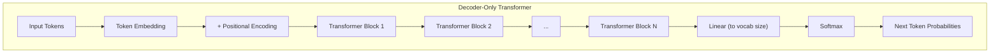
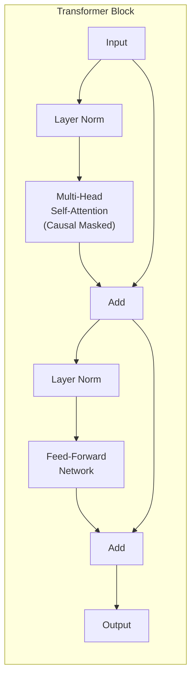
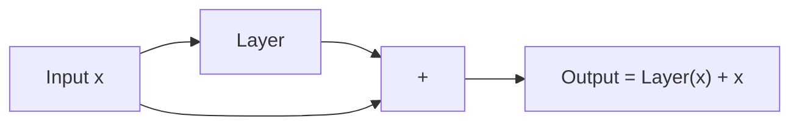

# Session 9: Building a Mini Transformer

## Teaching Script

### From Attention to Transformers

In the last session, we learned about attention mechanisms – how they allow every position to directly interact with every other position. The **Transformer** architecture (introduced in the famous "Attention Is All You Need" paper from 2017) takes this idea and runs with it: it builds an entire model using **only attention** (and some standard neural network components), with no RNNs at all.

This architecture is the foundation of GPT, BERT, and virtually all modern large language models.

### The Transformer Block

A Transformer is built from repeated **Transformer blocks**. Each block has two main components:

1. **Multi-Head Self-Attention**: The attention mechanism we learned about
2. **Feed-Forward Network (FFN)**: A simple neural network applied to each position independently

Both components use:
- **Residual connections**: Add the input to the output (like a "shortcut")
- **Layer normalization**: Normalize values to help training

```
Input → [Self-Attention] → Add & Norm → [FFN] → Add & Norm → Output
          ↓________________________↑       ↓______________↑
              (residual connection)         (residual connection)
```

### Why Residual Connections?

Residual connections (also called skip connections) add the input directly to the output:
```
output = layer(x) + x  # instead of just layer(x)
```

Benefits:
1. **Gradient flow**: Gradients can skip over layers, helping train deep networks
2. **Easy to learn identity**: If a layer isn't useful, it can learn to output zeros
3. **Stable training**: Prevents values from exploding or vanishing

### Multi-Head Attention: Looking at Different Things

Instead of doing attention once, we do it multiple times in parallel with different learned projections. Each "head" can learn to look for different patterns:
- Head 1 might focus on grammatical relationships
- Head 2 might focus on semantic similarity
- Head 3 might focus on positional patterns

The outputs of all heads are concatenated and projected:

```python
MultiHead(Q, K, V) = Concat(head_1, head_2, ..., head_h) @ W_o
where head_i = Attention(Q @ W_q_i, K @ W_k_i, V @ W_v_i)
```

### The Feed-Forward Network

After attention, each position independently passes through a small neural network:

```python
FFN(x) = ReLU(x @ W_1 + b_1) @ W_2 + b_2
```

This is where individual position representations get "processed." Think of it as giving each token time to "think" after gathering information via attention.

Typically, the hidden dimension is 4× the model dimension:
- Input: 512 dimensions
- Hidden: 2048 dimensions  
- Output: 512 dimensions

### Positional Encoding: Where Am I?

Unlike RNNs, attention has no inherent sense of position – it treats the input as a set, not a sequence. We need to explicitly add position information.

**Sinusoidal Positional Encoding** uses sine and cosine functions:

$$PE_{pos, 2i} = \sin(pos / 10000^{2i/d})$$
$$PE_{pos, 2i+1} = \cos(pos / 10000^{2i/d})$$

These are added to the input embeddings before the first Transformer block.

Why sinusoids?
- Unique pattern for each position
- The model can learn to attend to relative positions
- Can extrapolate to sequence lengths not seen during training

Modern models often use **learned positional embeddings** instead, which are simply trained like any other parameter.

### Putting It All Together: Decoder-Only Transformer

For language modeling (like GPT), we use a **decoder-only** architecture:

```
Input tokens
    ↓
Embedding + Positional Encoding
    ↓
[Transformer Block 1] (with causal masking)
    ↓
[Transformer Block 2] (with causal masking)
    ↓
... (more blocks)
    ↓
[Transformer Block N]
    ↓
Final Linear Layer → Vocabulary Logits
    ↓
Softmax → Probabilities
```

Key points:
- **Causal masking** in all attention layers (can't see future)
- Same architecture repeated N times (GPT-2 uses N=12 to 48)
- Final layer projects to vocabulary size

### How Training Works

Training is the same as our simpler models:

1. **Input**: Sequence of tokens [t₁, t₂, ..., tₙ]
2. **Target**: Next token for each position [t₂, t₃, ..., tₙ₊₁]
3. **Forward pass**: Compute predictions for all positions
4. **Loss**: Cross-entropy between predictions and targets
5. **Backward pass**: Compute gradients
6. **Update**: Adjust weights

Because of causal masking, we can train on all positions simultaneously (unlike RNNs which must process sequentially).

### Generation (Inference)

Generating text works the same as before:

1. Start with a prompt
2. Run through the Transformer
3. Sample from the output distribution for the last position
4. Append the new token to the input
5. Repeat

The difference is that Transformers can use **KV caching**: store the Key and Value tensors from previous positions to avoid recomputing them.

### Why Transformers Dominate

1. **Parallelization**: Process entire sequences at once during training
2. **Scalability**: Easy to make larger (more layers, more heads, bigger FFN)
3. **Long-range dependencies**: Direct attention between any positions
4. **Hardware efficiency**: Matrix operations map well to GPUs

The tradeoff: O(n²) attention complexity limits context length, though various techniques exist to address this (sparse attention, linear attention, etc.).

---

## Presentation Slides

### The Transformer Architecture



### Inside a Transformer Block



### Multi-Head Attention

| Heads | Each Head Learns | Combined Effect |
|-------|------------------|-----------------|
| Head 1 | Subject-verb relationships | Rich representation |
| Head 2 | Adjective-noun patterns | capturing multiple |
| Head 3 | Coreference (pronouns) | types of patterns |
| Head 4 | Positional patterns | simultaneously |

**Concatenate all heads → Project → Output**

### Positional Encoding

**Problem**: Attention treats input as a set, not a sequence!

**Solution**: Add position information to embeddings

**Sinusoidal encoding**:
- Position 0: [sin(0), cos(0), sin(0), cos(0), ...]
- Position 1: [sin(1/10000⁰), cos(1/10000⁰), sin(1/10000²), ...]
- Each position gets a unique pattern

**Or learned encoding**: Just train a matrix of shape (max_seq_len, d_model)

### The Residual Highway



**Benefits**:
- Gradients flow easily through addition
- Easy to learn identity (just output 0)
- Enables very deep networks (100+ layers)

### Comparing Model Architectures

| Feature | RNN | LSTM | Transformer |
|---------|-----|------|-------------|
| Sequential processing | Yes | Yes | No (parallel!) |
| Long-range learning | Hard | Better | Easy |
| Training speed | Slow | Slow | Fast |
| Max practical depth | ~3 layers | ~3 layers | 100+ layers |
| Positional awareness | Built-in | Built-in | Must add |
| Memory for inference | O(1) | O(1) | O(n) |

### Why Transformers Won

1. ⚡ **Speed**: Parallel training on GPUs
2. 📈 **Scalability**: Just add more layers/heads
3. 🔗 **Direct connections**: No vanishing gradients
4. 🎯 **Flexibility**: Works for text, images, audio, code...
5. 🏭 **Hardware match**: Matrix multiply = GPU heaven

---

## Code Walkthrough

### Minimal Transformer Language Model

```python
import torch
import torch.nn as nn
import torch.nn.functional as F
import math

class CausalSelfAttention(nn.Module):
    """
    Multi-head causal self-attention
    """
    def __init__(self, d_model, n_heads, max_seq_len):
        super().__init__()
        assert d_model % n_heads == 0
        
        self.d_model = d_model
        self.n_heads = n_heads
        self.head_dim = d_model // n_heads
        
        # Q, K, V projections combined for efficiency
        self.qkv_proj = nn.Linear(d_model, 3 * d_model)
        self.out_proj = nn.Linear(d_model, d_model)
        
        # Causal mask (lower triangular)
        # Register as buffer so it moves to GPU with the model
        mask = torch.tril(torch.ones(max_seq_len, max_seq_len))
        self.register_buffer('mask', mask)
    
    def forward(self, x):
        B, T, C = x.shape  # Batch, Sequence length, d_model
        
        # Compute Q, K, V
        qkv = self.qkv_proj(x)  # (B, T, 3*d_model)
        q, k, v = qkv.chunk(3, dim=-1)  # Each: (B, T, d_model)
        
        # Reshape for multi-head attention
        # (B, T, d_model) -> (B, n_heads, T, head_dim)
        q = q.view(B, T, self.n_heads, self.head_dim).transpose(1, 2)
        k = k.view(B, T, self.n_heads, self.head_dim).transpose(1, 2)
        v = v.view(B, T, self.n_heads, self.head_dim).transpose(1, 2)
        
        # Attention scores
        scale = 1.0 / math.sqrt(self.head_dim)
        scores = (q @ k.transpose(-2, -1)) * scale  # (B, n_heads, T, T)
        
        # Apply causal mask
        scores = scores.masked_fill(self.mask[:T, :T] == 0, float('-inf'))
        
        # Softmax and apply to values
        attn_weights = F.softmax(scores, dim=-1)
        out = attn_weights @ v  # (B, n_heads, T, head_dim)
        
        # Reshape back
        out = out.transpose(1, 2).contiguous().view(B, T, C)
        
        return self.out_proj(out)


class FeedForward(nn.Module):
    """
    Position-wise feed-forward network
    """
    def __init__(self, d_model, d_ff=None):
        super().__init__()
        if d_ff is None:
            d_ff = 4 * d_model  # Standard expansion factor
        
        self.net = nn.Sequential(
            nn.Linear(d_model, d_ff),
            nn.GELU(),  # Modern activation (smoother than ReLU)
            nn.Linear(d_ff, d_model)
        )
    
    def forward(self, x):
        return self.net(x)


class TransformerBlock(nn.Module):
    """
    Single transformer block: attention + FFN with residuals and layer norm
    """
    def __init__(self, d_model, n_heads, max_seq_len):
        super().__init__()
        self.ln1 = nn.LayerNorm(d_model)
        self.attn = CausalSelfAttention(d_model, n_heads, max_seq_len)
        self.ln2 = nn.LayerNorm(d_model)
        self.ffn = FeedForward(d_model)
    
    def forward(self, x):
        # Pre-norm architecture (used in GPT-2)
        x = x + self.attn(self.ln1(x))  # Attention with residual
        x = x + self.ffn(self.ln2(x))   # FFN with residual
        return x


class MiniTransformer(nn.Module):
    """
    Minimal GPT-style transformer for character-level language modeling
    """
    def __init__(self, vocab_size, d_model=64, n_heads=4, n_layers=2, max_seq_len=128):
        super().__init__()
        
        self.max_seq_len = max_seq_len
        
        # Token and position embeddings
        self.token_embed = nn.Embedding(vocab_size, d_model)
        self.pos_embed = nn.Embedding(max_seq_len, d_model)  # Learned positions
        
        # Transformer blocks
        self.blocks = nn.Sequential(*[
            TransformerBlock(d_model, n_heads, max_seq_len)
            for _ in range(n_layers)
        ])
        
        # Final layer norm and output projection
        self.ln_final = nn.LayerNorm(d_model)
        self.head = nn.Linear(d_model, vocab_size, bias=False)
    
    def forward(self, x):
        B, T = x.shape
        
        # Get embeddings
        tok_emb = self.token_embed(x)  # (B, T, d_model)
        pos = torch.arange(T, device=x.device)
        pos_emb = self.pos_embed(pos)  # (T, d_model)
        
        # Combine token and position embeddings
        x = tok_emb + pos_emb
        
        # Pass through transformer blocks
        x = self.blocks(x)
        
        # Final norm and project to vocabulary
        x = self.ln_final(x)
        logits = self.head(x)  # (B, T, vocab_size)
        
        return logits
    
    @torch.no_grad()
    def generate(self, idx, max_new_tokens, temperature=1.0):
        """
        Generate text autoregressively
        idx: (B, T) tensor of starting token indices
        """
        for _ in range(max_new_tokens):
            # Crop to max sequence length
            idx_cond = idx[:, -self.max_seq_len:]
            
            # Get predictions
            logits = self(idx_cond)
            
            # Focus on last position
            logits = logits[:, -1, :] / temperature
            
            # Sample
            probs = F.softmax(logits, dim=-1)
            idx_next = torch.multinomial(probs, num_samples=1)
            
            # Append
            idx = torch.cat([idx, idx_next], dim=1)
        
        return idx
```

### Training the Mini Transformer

```python
# Training example
torch.manual_seed(42)

# Sample text
text = """To be or not to be that is the question
Whether tis nobler in the mind to suffer
The slings and arrows of outrageous fortune"""

# Build vocabulary
chars = sorted(set(text))
vocab_size = len(chars)
char_to_idx = {ch: i for i, ch in enumerate(chars)}
idx_to_char = {i: ch for ch, i in char_to_idx.items()}

print(f"Vocabulary size: {vocab_size}")
print(f"Characters: {chars}")

# Encode text
data = torch.tensor([char_to_idx[ch] for ch in text], dtype=torch.long)

# Create training batches
def get_batch(data, seq_len, batch_size):
    """Get random sequences from data"""
    max_start = len(data) - seq_len - 1
    starts = torch.randint(0, max_start, (batch_size,))
    x = torch.stack([data[i:i+seq_len] for i in starts])
    y = torch.stack([data[i+1:i+seq_len+1] for i in starts])
    return x, y

# Initialize model
model = MiniTransformer(
    vocab_size=vocab_size,
    d_model=32,      # Small for demo
    n_heads=4,
    n_layers=2,
    max_seq_len=64
)

# Count parameters
n_params = sum(p.numel() for p in model.parameters())
print(f"Model parameters: {n_params:,}")

# Training setup
optimizer = torch.optim.Adam(model.parameters(), lr=0.001)
criterion = nn.CrossEntropyLoss()

# Training loop
print("\nTraining...")
seq_len = 32
batch_size = 4

for step in range(500):
    # Get batch
    x, y = get_batch(data, seq_len, batch_size)
    
    # Forward pass
    logits = model(x)
    
    # Compute loss
    loss = criterion(logits.view(-1, vocab_size), y.view(-1))
    
    # Backward pass
    optimizer.zero_grad()
    loss.backward()
    optimizer.step()
    
    if (step + 1) % 100 == 0:
        print(f"Step {step+1}, Loss: {loss.item():.4f}")

# Generate text
print("\n" + "="*50)
print("GENERATION")
print("="*50)

# Start with "To"
prompt = "To"
prompt_idx = torch.tensor([[char_to_idx[ch] for ch in prompt]], dtype=torch.long)

print(f"Prompt: '{prompt}'")
print(f"Generated:")

model.eval()
generated_idx = model.generate(prompt_idx, max_new_tokens=100, temperature=0.8)
generated_text = ''.join([idx_to_char[i.item()] for i in generated_idx[0]])
print(generated_text)
```

### Expected Output

```
Vocabulary size: 42
Characters: ['\n', ' ', 'T', 'W', 'a', 'b', 'd', 'e', ...]
Model parameters: 11,818

Training...
Step 100, Loss: 2.3456
Step 200, Loss: 1.5678
Step 300, Loss: 0.9876
Step 400, Loss: 0.5432
Step 500, Loss: 0.3210

==================================================
GENERATION
==================================================
Prompt: 'To'
Generated:
To be or not to be that is the question
Whether tis nobler in the mind to suffer
The slings and arrows...
```

---

## Quiz / Exercises

### 1. Transformer Components
Name the two main components inside each Transformer block and briefly describe what each does.

**Answer:**
1. **Multi-Head Self-Attention**: Allows each position to gather information from all other positions (respecting causal masking). Multiple heads let the model attend to different types of patterns simultaneously.

2. **Feed-Forward Network (FFN)**: A position-wise neural network (same network applied to each position independently) that processes the attended information. Think of it as giving each position time to "think" about the information it gathered.

Both are wrapped with residual connections and layer normalization.

### 2. Positional Encoding
Why do Transformers need positional encoding? What would happen without it?

**Answer:**
Attention is **permutation-invariant** – it treats the input as a set, not a sequence. The attention computation between positions doesn't depend on their actual positions in the sequence.

Without positional encoding:
- "The cat sat on the mat" would be processed identically to "mat the on sat cat The"
- The model couldn't learn word order or grammatical structure
- Language modeling would fail because predicting the next word requires knowing word order

Positional encoding adds position information directly to the embeddings so the model can distinguish positions.

### 3. Causal Masking in Transformers
How is causal masking implemented in our code? Find the relevant line and explain what it does.

**Answer:**
```python
scores = scores.masked_fill(self.mask[:T, :T] == 0, float('-inf'))
```

This line:
1. Takes `self.mask`, which is a lower-triangular matrix of ones (1s below and on diagonal, 0s above)
2. For positions where mask is 0 (future positions), fills the attention score with `-inf`
3. After softmax, `-inf` becomes 0, so future positions have zero attention weight

The mask is created as:
```python
mask = torch.tril(torch.ones(max_seq_len, max_seq_len))
```

### 4. Residual Connections
In the code, point to where residual connections are implemented. Why are they written as `x = x + layer(x)` rather than just `x = layer(x)`?

**Answer:**
In `TransformerBlock.forward()`:
```python
x = x + self.attn(self.ln1(x))  # Residual around attention
x = x + self.ffn(self.ln2(x))   # Residual around FFN
```

Writing `x = x + layer(x)` instead of `x = layer(x)`:
1. **Gradient flow**: During backpropagation, the gradient can flow directly through the addition (∂(x+f(x))/∂x = 1 + ...), providing a "gradient highway"
2. **Learning identity**: If a layer should do nothing, it just needs to output zeros
3. **Stable training**: Prevents values from exploding/vanishing through many layers
4. **Enables depth**: Makes it possible to train networks with 100+ layers

### 5. Multi-Head Attention
If we have d_model=64 and n_heads=4, what is the dimension of each head? Why might using multiple heads be better than one big attention operation?

**Answer:**
Each head has dimension: `head_dim = d_model // n_heads = 64 // 4 = 16`

Multiple heads are better because:
1. **Diverse attention patterns**: Each head can learn to attend to different types of relationships (e.g., subject-verb, adjective-noun, positional patterns)
2. **Parallel processing**: All heads compute simultaneously
3. **Richer representation**: The concatenated output captures multiple perspectives
4. **Regularization**: Having separate subspaces prevents the model from putting all information in one pattern

It's like having multiple experts, each looking at the text from a different angle, then combining their insights.

### 6. Code Modification Exercise
Modify the `MiniTransformer` to print the attention weights from the first head of the first layer during generation. (Hint: you'll need to modify `CausalSelfAttention` to optionally return attention weights)

**Answer:**
```python
class CausalSelfAttention(nn.Module):
    # ... (same __init__)
    
    def forward(self, x, return_attn=False):
        # ... (same attention computation until attn_weights)
        attn_weights = F.softmax(scores, dim=-1)
        out = attn_weights @ v
        out = out.transpose(1, 2).contiguous().view(B, T, C)
        
        if return_attn:
            return self.out_proj(out), attn_weights
        return self.out_proj(out)

# Then in TransformerBlock, pass return_attn parameter
# And in MiniTransformer.generate(), access and print the weights
```

### 7. Scaling Discussion
Our mini transformer has ~12K parameters. GPT-3 has 175 billion. What aspects of the architecture would you scale up to reach that size?

**Answer:**
To scale from ~12K to 175B parameters:

1. **d_model**: Increase from 32 to 12,288 (GPT-3)
2. **n_layers**: Increase from 2 to 96 (GPT-3)
3. **n_heads**: Increase from 4 to 96 (GPT-3)
4. **d_ff**: Increases with d_model (typically 4× d_model)
5. **vocab_size**: Use larger vocabulary (GPT-3 uses ~50K BPE tokens)
6. **max_seq_len**: Increase context window (2048 for GPT-3)

The beauty of Transformers is that this scaling is straightforward – just increase these numbers and train on more data. The architecture itself remains the same!
