# Session 10: Starting Your Report – Documenting the Journey

## Teaching Script

### Why Documentation Matters

Congratulations! You've built several language models – from simple bigrams to neural networks to RNNs to a mini Transformer. Now it's time to document your journey. Writing a report isn't just a school requirement; it's how real researchers share their work.

Think about it: the "Attention Is All You Need" paper that introduced Transformers has been cited over 100,000 times. Without clear documentation, that world-changing idea would have stayed in the heads of a few Google researchers.

### The Structure of a Technical Report

Your report should follow a clear structure:

1. **Title**: Clear, descriptive title of your project
2. **Abstract**: ~150-200 word summary of everything
3. **Introduction**: What problem are you solving? Why does it matter?
4. **Background**: What did you need to learn first? (N-grams, neural networks, etc.)
5. **Methods**: How did you build your models? (Architecture, training)
6. **Results**: What happened when you ran your models?
7. **Discussion**: What did you learn? What worked/didn't work?
8. **Conclusion**: Summary and future directions
9. **References**: Credit your sources

### Writing the Abstract

The abstract is your "elevator pitch" – someone should understand your entire project from these few sentences.

**Template:**
```
This project explores [TOPIC]. We built [WHAT YOU BUILT] to 
[WHAT IT DOES]. Our approach progressed from [STARTING POINT] 
to [ENDING POINT]. We found that [KEY FINDINGS]. 
The results demonstrate [CONCLUSION].
```

**Example:**
```
This project explores language model architectures from 
n-grams to Transformers. We built four progressively more 
sophisticated text generation systems: a bigram model, 
a neural language model, a character-level RNN, and a 
mini Transformer. Our experiments show that while simple 
models can capture local patterns, deeper architectures 
with attention mechanisms produce more coherent text over 
longer sequences. The results demonstrate the power of 
modern deep learning approaches to language understanding.
```

### Writing the Introduction

The introduction should:
1. **Hook the reader**: Start with something interesting
2. **Explain the problem**: What is language modeling? Why is it important?
3. **State your goals**: What did you set out to build?
4. **Preview your approach**: Brief overview of your methods
5. **Outline the report**: What's coming in each section

**Example opening:**
```
Every time you use autocomplete on your phone or ask ChatGPT 
a question, you're interacting with a language model. These 
systems predict what text should come next, enabling 
applications from machine translation to creative writing 
assistance. This project explores how language models work 
by building them from scratch, starting with simple 
statistical approaches and progressing to neural networks 
and attention-based architectures.
```

### Writing the Background

This section shows what you learned. Cover:
- What is a language model?
- N-gram models and probability
- Neural networks basics (inputs, weights, activation functions)
- Embeddings: turning words into numbers
- Sequence models: RNN, LSTM
- Attention mechanisms
- Transformers

For each concept:
1. Explain it simply
2. Give an example
3. Explain why it matters for language modeling

**Tip**: Use diagrams! A picture of an RNN unrolled through time is worth 1000 words.

### Writing the Methods Section

Describe what you built and how. For each model:

**Example structure for bigram model:**
```markdown
### Bigram Language Model

**Architecture**: The bigram model predicts each word based 
solely on the previous word. We construct a probability table 
where entry [i,j] contains the probability of word j 
following word i.

**Training**: We processed [CORPUS NAME] by:
1. Tokenizing the text into words/characters
2. Counting occurrences of each word pair
3. Converting counts to probabilities with add-k smoothing

**Generation**: To generate text, we:
1. Start with a seed word
2. Sample the next word from the probability distribution
3. Repeat until reaching desired length
```

Include:
- Hyperparameters (learning rate, hidden size, etc.)
- Training data used
- Number of epochs
- Any challenges and how you solved them

### Results Section: Show Your Data

This is where you present what happened. Include:

**Quantitative results:**
- Training loss curves
- Final loss values
- Perplexity (if calculated)

**Qualitative results:**
- Example generated text from each model
- Comparison of outputs

**Tables work well:**

| Model | Final Loss | Coherence (1-5) | Example Output |
|-------|------------|-----------------|----------------|
| Bigram | N/A | 2 | "the the the cat" |
| Neural LM | 2.3 | 3 | "the cat sat" |
| RNN | 1.5 | 4 | "the cat sat on the mat" |
| Transformer | 1.2 | 5 | "the cat sat quietly on the mat" |

### Discussion: What Did You Learn?

This is your chance to reflect:

**Compare the models:**
- Which produced better text? Why?
- What patterns could each model learn?
- What limitations did you observe?

**Discuss challenges:**
- What was hard to understand at first?
- What bugs did you encounter?
- What would you do differently?

**Connect to real-world:**
- How do your models relate to GPT/ChatGPT?
- What additional techniques do production models use?

### Conclusion

Summarize your journey:
1. What you set out to do
2. What you accomplished
3. Key insights
4. Future directions (what would you try next?)

**Example:**
```
This project successfully implemented language models of 
increasing sophistication, from bigrams to Transformers. 
The progression demonstrated how adding memory (RNN), 
selective memory (LSTM), and attention mechanisms leads 
to increasingly coherent text generation. Future work could 
explore larger datasets, more training, and techniques like 
byte-pair encoding that real models use.
```

### References

Cite your sources properly. Include:
- Original papers for techniques you used
- Tutorials or courses that helped
- Dataset sources

**Format:**
```
[1] Vaswani, A. et al. (2017). "Attention Is All You Need." 
    Advances in Neural Information Processing Systems.

[2] Jurafsky, D. & Martin, J. (2023). "Speech and Language 
    Processing." (Chapter 3: N-gram Language Models)
```

---

## Presentation Slides

### Report Structure Overview

```mermaid
flowchart TB
    title["📄 Report Structure"]
    title --> abstract["Abstract<br/>(150-200 words)"]
    abstract --> intro["Introduction<br/>(The 'Why')"]
    intro --> bg["Background<br/>(The 'What I Learned')"]
    bg --> methods["Methods<br/>(The 'How')"]
    methods --> results["Results<br/>(The 'What Happened')"]
    results --> discussion["Discussion<br/>(The 'So What')"]
    discussion --> conclusion["Conclusion<br/>(The 'Summary')"]
    conclusion --> refs["References<br/>(The 'Credit')"]
```



### Abstract Template

| Component | Example |
|-----------|---------|
| **Topic** | "This project explores language model architectures" |
| **What you built** | "We built four text generation systems" |
| **Approach** | "progressing from bigrams to Transformers" |
| **Key findings** | "attention mechanisms produce more coherent text" |
| **Conclusion** | "demonstrating the power of deep learning" |

**Goal**: Someone should understand your entire project in ~30 seconds

### Introduction Elements

```mermaid
flowchart LR
    hook["🎣 Hook<br/>(Grab attention)"] --> problem["❓ Problem<br/>(What & Why)"]
    problem --> goals["🎯 Goals<br/>(Your objectives)"]
    goals --> preview["👀 Preview<br/>(Your approach)"]
    preview --> outline["📋 Outline<br/>(Report structure)"]
```



### Methods: What to Include

For **each model** you built:

| Element | Example |
|---------|---------|
| **Architecture** | "2-layer RNN with 64 hidden units" |
| **Training data** | "Shakespeare's complete works (5MB)" |
| **Hyperparameters** | "lr=0.001, epochs=100, batch_size=32" |
| **Training process** | "Minimized cross-entropy loss using Adam" |
| **Challenges** | "Initially had exploding gradients, solved with gradient clipping" |

### Results: Show Don't Just Tell

**Include:**
- 📈 Training curves (loss over time)
- 📊 Tables comparing models
- 📝 Example outputs (good and bad!)
- 🔢 Quantitative metrics

**Example comparison table:**

| Model | Parameters | Training Time | Final Loss |
|-------|------------|---------------|------------|
| Bigram | ~1,000 | <1 sec | N/A |
| Neural LM | ~10,000 | 30 sec | 2.3 |
| RNN | ~20,000 | 2 min | 1.5 |
| Transformer | ~15,000 | 1 min | 1.2 |

### Discussion Questions to Answer

- 🤔 Why did more complex models perform better?
- 🔍 What patterns could each model/couldn't capture?
- 💡 What was the most surprising thing you learned?
- 🛠️ What would you do differently next time?
- 🌍 How does this relate to ChatGPT?

### Writing Tips

| Do ✅ | Don't ❌ |
|-------|---------|
| Use clear, simple language | Use jargon without explaining |
| Show examples | Only describe abstractly |
| Admit limitations | Claim perfection |
| Credit sources | Present others' work as yours |
| Include visuals | Write walls of text |
| Be specific | Be vague ("it worked well") |

---

## Practical Exercise: Start Your Report

### Task 1: Write Your Abstract (15 min)

Using the template, write a 150-200 word abstract for your project.

**Template to fill in:**
```
This project explores ________________________. 
I built ________________________ to ________________________.
My approach progressed from ________________________ to 
________________________. I found that ________________________.
The results demonstrate ________________________.
```

### Task 2: Draft Your Introduction Opening (15 min)

Write the first paragraph of your introduction. Include:
- A hook (something interesting about language models)
- Why language models matter
- What you set out to do

### Task 3: Create a Methods Outline (10 min)

For each model you built, list:
1. Model name
2. Key architecture details
3. Training data used
4. Important hyperparameters
5. One challenge you faced

### Task 4: Gather Your Results (10 min)

Create a comparison table with:
- All models you built
- Number of parameters (approximate)
- Final training loss
- One example output from each

### Task 5: Start Your References List (10 min)

List at least 3-5 sources you used:
- Original papers (Attention Is All You Need, LSTM paper, etc.)
- Tutorials or course materials
- Dataset sources

---

## Report Checklist

Use this checklist as you write:

### Structure
- [ ] Title is clear and descriptive
- [ ] Abstract summarizes the entire project (150-200 words)
- [ ] Introduction hooks the reader and explains motivation
- [ ] Background explains necessary concepts
- [ ] Methods describes what you built and how
- [ ] Results presents data with tables/figures
- [ ] Discussion interprets results and reflects
- [ ] Conclusion summarizes and suggests future work
- [ ] References properly cited

### Content Quality
- [ ] Technical terms are explained when first used
- [ ] Includes diagrams/figures where helpful
- [ ] Code snippets are formatted and explained
- [ ] Results include both quantitative and qualitative
- [ ] Limitations are acknowledged
- [ ] Comparison between models is clear

### Writing Quality
- [ ] Clear, concise sentences
- [ ] Logical flow between sections
- [ ] Consistent terminology throughout
- [ ] Spell-checked and proofread
- [ ] Appropriate length (aim for 3000-5000 words)

### Figures and Tables
- [ ] All figures have captions
- [ ] All tables have headers
- [ ] Figures/tables are referenced in text
- [ ] Visual elements are clear and readable

---

## Quiz / Exercises

### 1. Abstract Purpose
What is the purpose of an abstract, and what should it contain?

**Answer:** The abstract is a concise summary (150-200 words) of the entire project. It should contain:
- What the project is about (topic)
- What you built/did (methods)
- What you found (key results)
- What it means (conclusion)

A reader should be able to understand your entire project from just the abstract. It's like a movie trailer for your research.

### 2. Introduction vs Background
What's the difference between the Introduction and Background sections?

**Answer:**
- **Introduction**: Explains the "why" – motivates the problem, states your goals, and previews your approach. It's about your project specifically and what you're trying to accomplish.

- **Background**: Explains the "what" – covers the technical concepts someone needs to understand your work. It's about the field and prior knowledge (what is an n-gram, what is a neural network, etc.).

The Introduction is about your project; the Background is about the concepts.

### 3. Results vs Discussion
A student puts "The RNN worked better than the bigram model because it has memory" in their Results section. Is this correct? Why or why not?

**Answer:** No, this is incorrect. 

- **Results** should present what happened (data, measurements, outputs) without interpretation. "The RNN achieved a final loss of 1.5 compared to the neural LM's 2.3" is a result.

- **Discussion** is where you interpret why things happened. "The RNN worked better because it has memory to track context" is interpretation and belongs in Discussion.

Think: Results = "what I measured"; Discussion = "what it means"

### 4. Reference Importance
Why is it important to include references in a technical report?

**Answer:**
1. **Credit**: Acknowledges the work of others that made yours possible
2. **Credibility**: Shows your work is grounded in established research
3. **Reproducibility**: Allows readers to learn more about techniques you used
4. **Academic integrity**: Avoids plagiarism by properly attributing ideas
5. **Context**: Helps readers understand where your work fits in the field

Not citing sources is academic misconduct and undermines your credibility.

### 5. Practical Task
You ran an experiment where your Transformer achieved loss of 1.2 after 500 steps, while your RNN achieved 1.5 after 500 steps. The Transformer also generated more coherent text. Write one sentence for the Results section and one sentence for the Discussion section about this.

**Answer:**
- **Results sentence**: "After 500 training steps, the Transformer achieved a final loss of 1.2, compared to 1.5 for the RNN, and produced notably more coherent multi-sentence outputs."

- **Discussion sentence**: "The Transformer's superior performance likely stems from its attention mechanism, which allows direct connections between any two positions in the sequence, enabling it to maintain coherence over longer spans than the RNN's sequential hidden state updates."
