# Session 11: Model Improvement and Evaluation

## Teaching Script

### Beyond Training Loss: What Makes a Good Language Model?

So far, we've trained our models to minimize cross-entropy loss on our training data. But a low training loss doesn't guarantee a good model! The model might be:
- **Overfitting**: Memorizing training data instead of learning patterns
- **Producing nonsense**: Low loss but incoherent outputs
- **Missing patterns**: Good average loss but failing on specific cases

Today we'll explore how to properly evaluate language models and techniques to improve them.

### Perplexity: The Standard LM Metric

**Perplexity** is the standard metric for language models. It measures how "surprised" the model is by the test data.

$$\text{Perplexity} = 2^{-\frac{1}{N}\sum_{i=1}^{N}\log_2 P(w_i|context)}$$

Or equivalently:
$$\text{Perplexity} = e^{\text{average cross-entropy loss}}$$

**Intuition:**
- Perplexity ≈ average number of words the model is "choosing between"
- Perplexity of 100 means the model is as uncertain as if it were choosing from 100 equally likely words
- Lower is better! GPT-2 achieves perplexity ~30 on standard benchmarks

**Simple interpretation:**
- Perplexity 1: Perfect prediction (knows exactly what comes next)
- Perplexity = vocab size: Random guessing
- Good models: Usually perplexity 10-100 depending on task

### Train/Validation/Test Split

Never evaluate on training data! Standard practice:
- **Training set** (80%): Used to update model weights
- **Validation set** (10%): Used to tune hyperparameters, check for overfitting
- **Test set** (10%): Used only once, for final evaluation

```python
# Example split
data = "your full text corpus..."
n = len(data)
train_data = data[:int(0.8*n)]
val_data = data[int(0.8*n):int(0.9*n)]
test_data = data[int(0.9*n):]
```

**Key rule:** Never use test set to make decisions! Only evaluate on it once at the very end.

### Detecting Overfitting

Plot training loss AND validation loss:

```
Loss
  |  
  |  Training ....____________________
  |            ...
  |           .. 
  |  Val     ... ....______.........------ (plateaus or rises!)
  |         ..        
  |_________________________________________ Epochs
```

Signs of overfitting:
- Validation loss stops decreasing while training loss continues to drop
- Validation loss starts increasing while training loss decreases
- Generated text on validation data is worse than on training data

### Techniques to Prevent Overfitting

**1. Dropout**
Randomly "turn off" neurons during training (typically 10-50%):
```python
self.dropout = nn.Dropout(p=0.1)
x = self.dropout(x)  # During training, randomly zeros 10% of values
```

**2. Weight Decay (L2 Regularization)**
Add penalty for large weights:
```python
optimizer = torch.optim.Adam(model.parameters(), lr=0.001, weight_decay=0.01)
```

**3. Early Stopping**
Stop training when validation loss stops improving:
```python
best_val_loss = float('inf')
patience = 5
patience_counter = 0

for epoch in range(max_epochs):
    train_loss = train_one_epoch()
    val_loss = evaluate(val_data)
    
    if val_loss < best_val_loss:
        best_val_loss = val_loss
        save_model()
        patience_counter = 0
    else:
        patience_counter += 1
        if patience_counter >= patience:
            print("Early stopping!")
            break
```

**4. Data Augmentation**
For language: use more diverse training data, or techniques like back-translation.

### Hyperparameter Tuning

Key hyperparameters to tune:
- **Learning rate**: Too high = unstable, too low = slow
- **Hidden size**: More capacity, but more overfitting risk
- **Number of layers**: Deeper = more expressive, but harder to train
- **Batch size**: Larger = more stable gradients, but may generalize worse
- **Dropout rate**: Higher = more regularization

**Grid search** (systematic):
```python
learning_rates = [0.01, 0.001, 0.0001]
hidden_sizes = [32, 64, 128]

for lr in learning_rates:
    for hs in hidden_sizes:
        model = create_model(hidden_size=hs)
        val_loss = train_and_evaluate(model, lr)
        print(f"lr={lr}, hidden={hs}, val_loss={val_loss}")
```

**Random search** (often more efficient):
```python
for _ in range(20):
    lr = 10 ** random.uniform(-4, -1)  # Log-uniform
    hs = random.choice([32, 64, 128, 256])
    # ... train and evaluate
```

### Qualitative Evaluation: Human Judgment

Numbers don't tell the whole story. Also evaluate by reading outputs:

**Coherence**: Does the text make sense?
- Bad: "the the the cat the"
- Better: "the cat sat on mat"
- Good: "the cat sat quietly on the warm mat"

**Consistency**: Does it maintain topics/style?
- Bad: "The cat sat. Quantum physics is fascinating. Meow."
- Good: "The cat sat. It stretched lazily. Then it purred."

**Diversity**: Does it generate varied outputs?
- Bad: Always generates the same 5 sentences
- Good: Different outputs for different prompts/samples

### Evaluation Protocol

Create a systematic evaluation:

```markdown
## Evaluation Criteria

For each model, generate 10 samples and rate:

1. **Grammaticality** (1-5): Is the text grammatically correct?
2. **Coherence** (1-5): Does it make sense?
3. **Relevance** (1-5): Does it stay on topic?
4. **Fluency** (1-5): Does it read naturally?

Also record:
- Perplexity on test set
- Example outputs (good and bad)
- Notable patterns or failures
```

### Improving Your Models

**1. More/Better Data**
- Clean data: Remove errors, duplicates
- More data: Language models are data-hungry
- Relevant data: Train on text similar to your target

**2. Architecture Changes**
- More layers (if you have enough data)
- Different hidden sizes
- Add layer normalization if not present
- Try different attention patterns

**3. Training Improvements**
- Learning rate scheduling (start high, decrease over time)
- Gradient clipping (prevents exploding gradients)
- Warmup (slowly increase learning rate at start)

**4. Generation Improvements**
- Temperature tuning: Higher = more random, Lower = more deterministic
- Top-k sampling: Only sample from top k most likely tokens
- Nucleus sampling (top-p): Sample from smallest set covering probability p

### Learning Rate Scheduling

Don't use constant learning rate:

```python
# Learning rate warmup + decay
warmup_steps = 100
total_steps = 1000

def get_lr(step):
    if step < warmup_steps:
        return learning_rate * step / warmup_steps  # Linear warmup
    else:
        # Cosine decay
        progress = (step - warmup_steps) / (total_steps - warmup_steps)
        return learning_rate * 0.5 * (1 + math.cos(math.pi * progress))

# In training loop:
for step in range(total_steps):
    lr = get_lr(step)
    for param_group in optimizer.param_groups:
        param_group['lr'] = lr
    # ... rest of training
```

### Temperature and Sampling

Control randomness in generation:

```python
def generate_with_temperature(model, prompt, temperature=1.0):
    logits = model(prompt)
    
    # Temperature scaling
    logits = logits / temperature
    # temperature > 1: More random (flatter distribution)
    # temperature < 1: More deterministic (sharper distribution)
    # temperature = 1: Original distribution
    
    probs = F.softmax(logits, dim=-1)
    next_token = torch.multinomial(probs, 1)
    return next_token

# Top-k sampling
def top_k_sampling(logits, k=50):
    values, indices = torch.topk(logits, k)
    probs = F.softmax(values, dim=-1)
    next_token = indices[torch.multinomial(probs, 1)]
    return next_token
```

---

## Presentation Slides

### Why Training Loss Isn't Enough

```mermaid
flowchart LR
    subgraph Problems
        overfit["🎯 Overfitting<br/>Memorizes training data"]
        nonsense["🤪 Nonsense<br/>Low loss, bad output"]
        missing["❌ Missing patterns<br/>Fails on edge cases"]
    end
    
    loss["Low Training Loss"] --> overfit
    loss --> nonsense
    loss --> missing
```



**Solution**: Proper evaluation methodology!

### Perplexity Explained

| Perplexity | Meaning | Example |
|------------|---------|---------|
| 1 | Perfect prediction | Knows exactly what's next |
| 10 | Choosing from ~10 words | Good language model |
| 100 | Choosing from ~100 words | Decent model |
| Vocab size | Random guessing | Untrained model |

$$\text{Perplexity} = e^{\text{cross-entropy loss}}$$

**Lower is better!**

### Train/Validation/Test Split



```mermaid
flowchart LR
    data["📚 Full Dataset"] --> train["🏋️ Train (80%)<br/>Update weights"]
    data --> val["🔍 Validation (10%)<br/>Tune hyperparameters"]
    data --> test["📝 Test (10%)<br/>Final evaluation ONLY"]
```

**Golden Rule**: Never use test set for decisions!

### Detecting Overfitting

```
Loss
  │
  │   Training loss
  │   ↘ 
  │     ↘_______________
  │                      
  │   Validation loss    ← Gap = overfitting!
  │   ↘
  │     ↘_____↗ starts rising
  │
  └─────────────────────── Epochs
```

**Signs**: Val loss plateaus or rises while train loss drops

### Fighting Overfitting

| Technique | How It Works | Code |
|-----------|--------------|------|
| **Dropout** | Randomly disable neurons | `nn.Dropout(0.1)` |
| **Weight Decay** | Penalize large weights | `weight_decay=0.01` |
| **Early Stopping** | Stop when val loss rises | Monitor val loss |
| **More Data** | More examples to learn from | Collect more text |

### Hyperparameter Tuning

**Key parameters to tune:**
| Parameter | Too Low | Too High |
|-----------|---------|----------|
| Learning Rate | Slow training | Unstable training |
| Hidden Size | Underfitting | Overfitting |
| Layers | Limited capacity | Hard to train |
| Dropout | Overfitting | Underfitting |

**Strategy**: Start with published defaults, then tune systematically

### Improving Generation Quality


### Evaluation Checklist

**Quantitative:**
- [ ] Perplexity on test set
- [ ] Training vs validation loss curves
- [ ] Parameter count

**Qualitative:**
- [ ] Sample 10+ generations
- [ ] Rate coherence (1-5)
- [ ] Rate grammaticality (1-5)
- [ ] Note patterns and failures

---

## Code Walkthrough

### Computing Perplexity

```python
import torch
import torch.nn.functional as F
import math

def compute_perplexity(model, data, seq_len=32):
    """
    Compute perplexity on a dataset
    """
    model.eval()
    total_loss = 0
    total_tokens = 0
    
    with torch.no_grad():
        for i in range(0, len(data) - seq_len - 1, seq_len):
            x = data[i:i+seq_len].unsqueeze(0)
            y = data[i+1:i+seq_len+1].unsqueeze(0)
            
            logits = model(x)
            loss = F.cross_entropy(logits.view(-1, logits.size(-1)), y.view(-1))
            
            total_loss += loss.item() * seq_len
            total_tokens += seq_len
    
    avg_loss = total_loss / total_tokens
    perplexity = math.exp(avg_loss)
    
    return perplexity, avg_loss

# Example usage:
# train_ppl, train_loss = compute_perplexity(model, train_data)
# val_ppl, val_loss = compute_perplexity(model, val_data)
# print(f"Train Perplexity: {train_ppl:.2f}, Val Perplexity: {val_ppl:.2f}")
```

### Training with Validation

```python
def train_with_validation(model, train_data, val_data, 
                          epochs=100, lr=0.001, patience=5):
    """
    Train with early stopping based on validation loss
    """
    optimizer = torch.optim.Adam(model.parameters(), lr=lr, weight_decay=0.01)
    criterion = nn.CrossEntropyLoss()
    
    best_val_loss = float('inf')
    patience_counter = 0
    train_losses = []
    val_losses = []
    
    for epoch in range(epochs):
        # Training
        model.train()
        train_loss = train_one_epoch(model, train_data, optimizer, criterion)
        train_losses.append(train_loss)
        
        # Validation
        model.eval()
        val_loss = evaluate(model, val_data, criterion)
        val_losses.append(val_loss)
        
        print(f"Epoch {epoch+1}: Train Loss = {train_loss:.4f}, Val Loss = {val_loss:.4f}")
        
        # Early stopping check
        if val_loss < best_val_loss:
            best_val_loss = val_loss
            torch.save(model.state_dict(), 'best_model.pt')
            patience_counter = 0
        else:
            patience_counter += 1
            if patience_counter >= patience:
                print(f"Early stopping at epoch {epoch+1}")
                break
    
    # Load best model
    model.load_state_dict(torch.load('best_model.pt'))
    
    return train_losses, val_losses

def train_one_epoch(model, data, optimizer, criterion, seq_len=32, batch_size=4):
    total_loss = 0
    num_batches = 0
    
    for _ in range(100):  # Fixed number of batches per epoch
        x, y = get_batch(data, seq_len, batch_size)
        
        optimizer.zero_grad()
        logits = model(x)
        loss = criterion(logits.view(-1, logits.size(-1)), y.view(-1))
        loss.backward()
        
        # Gradient clipping
        torch.nn.utils.clip_grad_norm_(model.parameters(), 1.0)
        
        optimizer.step()
        
        total_loss += loss.item()
        num_batches += 1
    
    return total_loss / num_batches

def evaluate(model, data, criterion, seq_len=32):
    total_loss = 0
    num_batches = 0
    
    with torch.no_grad():
        for i in range(0, len(data) - seq_len - 1, seq_len):
            x = data[i:i+seq_len].unsqueeze(0)
            y = data[i+1:i+seq_len+1].unsqueeze(0)
            
            logits = model(x)
            loss = criterion(logits.view(-1, logits.size(-1)), y.view(-1))
            
            total_loss += loss.item()
            num_batches += 1
    
    return total_loss / num_batches
```

### Adding Dropout to Your Model

```python
class ImprovedTransformerBlock(nn.Module):
    def __init__(self, d_model, n_heads, max_seq_len, dropout=0.1):
        super().__init__()
        self.ln1 = nn.LayerNorm(d_model)
        self.attn = CausalSelfAttention(d_model, n_heads, max_seq_len)
        self.ln2 = nn.LayerNorm(d_model)
        self.ffn = FeedForward(d_model)
        
        # Add dropout
        self.dropout1 = nn.Dropout(dropout)
        self.dropout2 = nn.Dropout(dropout)
    
    def forward(self, x):
        x = x + self.dropout1(self.attn(self.ln1(x)))  # Dropout after attention
        x = x + self.dropout2(self.ffn(self.ln2(x)))   # Dropout after FFN
        return x
```

### Hyperparameter Search

```python
import random

def hyperparameter_search(train_data, val_data, n_trials=10):
    """
    Random search for hyperparameters
    """
    best_config = None
    best_val_loss = float('inf')
    results = []
    
    for trial in range(n_trials):
        # Random hyperparameters
        config = {
            'lr': 10 ** random.uniform(-4, -2),        # 0.0001 to 0.01
            'd_model': random.choice([32, 64, 128]),
            'n_layers': random.choice([1, 2, 3]),
            'n_heads': random.choice([2, 4]),
            'dropout': random.uniform(0.0, 0.3)
        }
        
        print(f"\nTrial {trial + 1}: {config}")
        
        # Create and train model
        model = MiniTransformer(
            vocab_size=vocab_size,
            d_model=config['d_model'],
            n_heads=config['n_heads'],
            n_layers=config['n_layers'],
            dropout=config['dropout']
        )
        
        # Train for a few epochs
        optimizer = torch.optim.Adam(model.parameters(), lr=config['lr'])
        # ... training loop (abbreviated)
        
        # Evaluate
        val_loss = evaluate(model, val_data)
        results.append((config, val_loss))
        
        if val_loss < best_val_loss:
            best_val_loss = val_loss
            best_config = config
            print(f"  New best! Val Loss = {val_loss:.4f}")
    
    print(f"\nBest config: {best_config}")
    print(f"Best val loss: {best_val_loss:.4f}")
    
    return best_config, results
```

### Improved Generation with Temperature and Top-k

```python
@torch.no_grad()
def generate_improved(model, idx, max_new_tokens, 
                      temperature=1.0, top_k=None):
    """
    Generate with temperature scaling and optional top-k sampling
    """
    model.eval()
    
    for _ in range(max_new_tokens):
        # Get logits for last position
        idx_cond = idx[:, -model.max_seq_len:]
        logits = model(idx_cond)
        logits = logits[:, -1, :]  # (B, vocab_size)
        
        # Temperature scaling
        logits = logits / temperature
        
        # Optional top-k filtering
        if top_k is not None:
            # Keep only top-k logits, set rest to -inf
            values, _ = torch.topk(logits, top_k)
            min_value = values[:, -1].unsqueeze(-1)
            logits = torch.where(
                logits < min_value,
                torch.full_like(logits, float('-inf')),
                logits
            )
        
        # Sample
        probs = F.softmax(logits, dim=-1)
        idx_next = torch.multinomial(probs, num_samples=1)
        idx = torch.cat([idx, idx_next], dim=1)
    
    return idx

# Example usage:
# High temperature = more random, creative
creative_text = generate_improved(model, prompt, 100, temperature=1.2, top_k=50)

# Low temperature = more focused, deterministic
focused_text = generate_improved(model, prompt, 100, temperature=0.7, top_k=20)
```

### Qualitative Evaluation Script

```python
def qualitative_evaluation(model, prompts, n_samples=5):
    """
    Generate samples and display for human evaluation
    """
    print("="*60)
    print("QUALITATIVE EVALUATION")
    print("="*60)
    
    for prompt in prompts:
        print(f"\n--- Prompt: '{prompt}' ---\n")
        
        for i in range(n_samples):
            # Vary temperature for diversity
            temp = 0.7 + 0.2 * i  # 0.7, 0.9, 1.1, 1.3, 1.5
            
            prompt_idx = encode(prompt)
            generated_idx = generate_improved(
                model, prompt_idx, 
                max_new_tokens=50, 
                temperature=temp, 
                top_k=40
            )
            generated_text = decode(generated_idx[0])
            
            print(f"Sample {i+1} (temp={temp:.1f}):")
            print(f"  {generated_text}\n")
    
    print("\nRate each sample on:")
    print("  1. Coherence (1-5)")
    print("  2. Grammaticality (1-5)")
    print("  3. Relevance to prompt (1-5)")

# Example usage
prompts = ["The cat", "Once upon a", "To be or not"]
qualitative_evaluation(model, prompts)
```

---

## Quiz / Exercises

### 1. Perplexity Understanding
A model has perplexity 50 on the test set. What does this mean intuitively?

**Answer:** Perplexity of 50 means that, on average, the model is as uncertain about the next token as if it were choosing uniformly from 50 equally likely options. In other words, at each prediction step, the model effectively has about 50 reasonable choices. Lower perplexity is better – perplexity 1 would mean perfect prediction, while perplexity equal to vocabulary size would mean random guessing.

### 2. Overfitting Detection
You plot your training curves and see: Training loss = 0.5, Validation loss = 2.1, and they're diverging. What's happening and what should you do?

**Answer:** This is classic overfitting – the model is memorizing the training data instead of learning generalizable patterns. The large gap between training and validation loss (0.5 vs 2.1) indicates the model performs much better on data it's seen before.

Solutions:
1. Add/increase dropout regularization
2. Add/increase weight decay
3. Use early stopping (stop training earlier)
4. Get more training data
5. Reduce model size (fewer layers/smaller hidden size)
6. Use data augmentation if possible

### 3. Hyperparameter Intuition
Your model trains but the loss oscillates wildly and never converges. Which hyperparameter is most likely the problem, and how should you change it?

**Answer:** The most likely culprit is the **learning rate** being too high. When the learning rate is too large, each update overshoots the optimal point, causing the loss to bounce around instead of smoothly decreasing.

**Solution:** Reduce the learning rate (e.g., from 0.01 to 0.001 or 0.0001). You might also consider:
- Learning rate warmup (start very low, gradually increase)
- Gradient clipping (to prevent extreme updates)
- Learning rate scheduling (start higher, decrease over time)

### 4. Temperature Effects
Explain the effect of temperature on text generation. What happens with temperature = 0.5 vs temperature = 2.0?

**Answer:**
Temperature scales the logits before softmax: `logits / temperature`

**Temperature = 0.5 (low):**
- Dividing by 0.5 = multiplying by 2, making large logits even larger
- Softmax becomes "sharper" – high-probability tokens get even higher probability
- Generation becomes more deterministic/focused
- Output tends to be more repetitive but grammatically safer

**Temperature = 2.0 (high):**
- Dividing by 2.0 makes all logits smaller
- Softmax becomes "flatter" – probabilities become more uniform
- Generation becomes more random/diverse
- Output is more creative but may be less coherent/grammatical

**Tip:** Temperature ~0.7-1.0 often works well for coherent but somewhat varied text.

### 5. Practical Exercise
Given these results, which model would you choose and why?

| Model | Train Loss | Val Loss | Perplexity (Val) | Coherence Rating |
|-------|------------|----------|------------------|------------------|
| A | 0.3 | 2.5 | 12.2 | 3.5/5 |
| B | 1.2 | 1.4 | 4.1 | 4.2/5 |
| C | 0.8 | 1.0 | 2.7 | 3.8/5 |

**Answer:** **Model B** is likely the best choice despite not having the lowest perplexity:

- Model A is severely overfitting (train 0.3 vs val 2.5 is a huge gap)
- Model C has good numbers but lower human coherence rating
- Model B has:
  - Small train/val gap (1.2 vs 1.4) = good generalization
  - Reasonable perplexity (4.1)
  - Highest coherence rating (4.2/5)

The coherence rating matters because perplexity doesn't capture everything humans care about. A model might have low perplexity by predicting common words well but fail on fluency or meaning. Model B seems to have the best balance of generalization and output quality.

### 6. Code Exercise
Write a function that computes both train and validation loss, and prints a warning if the model appears to be overfitting.

**Answer:**
```python
def check_overfitting(model, train_data, val_data, threshold=1.5):
    """
    Compare train and val loss, warn if overfitting
    """
    criterion = nn.CrossEntropyLoss()
    
    train_loss = evaluate(model, train_data, criterion)
    val_loss = evaluate(model, val_data, criterion)
    
    ratio = val_loss / train_loss
    
    print(f"Train Loss: {train_loss:.4f}")
    print(f"Val Loss:   {val_loss:.4f}")
    print(f"Ratio:      {ratio:.2f}")
    
    if ratio > threshold:
        print(f"⚠️ WARNING: Possible overfitting detected!")
        print(f"   Val loss is {ratio:.1f}x higher than train loss")
        print(f"   Consider: more dropout, weight decay, or early stopping")
    else:
        print(f"✓ Model appears to be generalizing well")
    
    return train_loss, val_loss, ratio
```
