# Session 12: Final Report, Polish, and Publishing

## Teaching Script

### The Final Push

Congratulations! You've reached the final session of your journey from simple n-grams to Transformers. Today is about bringing everything together into a polished final report and reflecting on what you've accomplished.

This session focuses on:
1. Finalizing and polishing your report
2. Creating effective visualizations
3. Preparing a compelling presentation
4. Reflecting on your learning journey
5. Thinking about what comes next

### Report Review and Polish

Go through your report systematically:

**Structure Check:**
- Does the abstract accurately summarize everything?
- Does each section flow logically to the next?
- Are there any gaps where you forgot to explain something?
- Is the conclusion meaningful (not just repeating the abstract)?

**Technical Accuracy:**
- Are all code snippets correct and runnable?
- Are all formulas correct and properly explained?
- Do all numbers and results match your actual experiments?
- Have you properly explained technical terms?

**Writing Quality:**
- Read your report out loud – does it flow?
- Are sentences clear and concise?
- Have you avoided unnecessary jargon?
- Is spelling and grammar correct?

### Creating Effective Figures

Good figures can make or break a technical report.

**Training Curves:**
```python
import matplotlib.pyplot as plt

plt.figure(figsize=(10, 6))
plt.plot(train_losses, label='Training Loss', color='blue')
plt.plot(val_losses, label='Validation Loss', color='orange')
plt.xlabel('Epoch')
plt.ylabel('Loss')
plt.title('Training Progress: RNN Language Model')
plt.legend()
plt.grid(True, alpha=0.3)
plt.savefig('training_curve.png', dpi=150, bbox_inches='tight')
```

**Model Comparison Bar Chart:**
```python
models = ['Bigram', 'Neural LM', 'RNN', 'Transformer']
perplexities = [150, 85, 45, 32]

plt.figure(figsize=(8, 5))
plt.bar(models, perplexities, color=['#1f77b4', '#ff7f0e', '#2ca02c', '#d62728'])
plt.xlabel('Model')
plt.ylabel('Perplexity (lower is better)')
plt.title('Model Comparison: Test Perplexity')
for i, v in enumerate(perplexities):
    plt.text(i, v + 2, str(v), ha='center')
plt.savefig('model_comparison.png', dpi=150, bbox_inches='tight')
```

**Tips for figures:**
- Always include axis labels and titles
- Use consistent colors across related figures
- Make text large enough to read
- Include legends when showing multiple things
- Save at high resolution (150+ DPI)

### Architecture Diagrams

Include clear diagrams of your model architectures. Use tools like:
- **Mermaid** (in Markdown)
- **Draw.io** (free web-based)
- **Hand-drawn** (scanned) – authenticity can be good!

**Example Mermaid diagram for your report:**

```mermaid
flowchart TB
    subgraph "Mini Transformer Architecture"
        input["Input: 'The cat sat'"]
        embed["Token Embedding<br/>(vocab_size × d_model)"]
        pos["+ Positional Encoding"]
        
        subgraph block1["Transformer Block 1"]
            attn1["Multi-Head Self-Attention"]
            ffn1["Feed-Forward Network"]
        end
        
        subgraph block2["Transformer Block 2"]
            attn2["Multi-Head Self-Attention"]
            ffn2["Feed-Forward Network"]
        end
        
        final["Final Layer Norm"]
        proj["Linear Projection<br/>(d_model → vocab_size)"]
        output["Output: Probabilities for next token"]
        
        input --> embed --> pos --> block1 --> block2 --> final --> proj --> output
    end
```


### Writing a Strong Conclusion

Your conclusion should:
1. **Summarize key achievements** (without just repeating)
2. **Highlight most important insights**
3. **Acknowledge limitations honestly**
4. **Suggest future directions**
5. **End with impact/significance**

**Template:**
```markdown
## Conclusion

This project successfully implemented [SUMMARY OF WHAT YOU BUILT].

The key insight from this work is [MOST IMPORTANT THING YOU LEARNED].
Specifically, we found that [CONCRETE FINDING].

Several limitations should be acknowledged. [HONEST LIMITATIONS - 
e.g., small dataset, limited compute, simplified architecture].

Future work could explore [REALISTIC NEXT STEPS - e.g., larger 
datasets, more training, different architectures, specific 
improvements].

This project demonstrates [BROADER SIGNIFICANCE - e.g., how 
modern language models work, the progression from simple to 
complex, the power of attention mechanisms].
```

### Proper Citations

Every claim not your own needs a citation. Format:

**In-text:**
- "Transformers were introduced by Vaswani et al. [1]"
- "The attention mechanism allows direct connections between positions [1,2]"

**Reference list:**
```
[1] Vaswani, A., Shazeer, N., Parmar, N., et al. (2017). 
    "Attention Is All You Need." Advances in Neural 
    Information Processing Systems 30.

[2] Bahdanau, D., Cho, K., & Bengio, Y. (2014). 
    "Neural Machine Translation by Jointly Learning to 
    Align and Translate." arXiv:1409.0473.

[3] Hochreiter, S., & Schmidhuber, J. (1997). 
    "Long Short-Term Memory." Neural Computation, 9(8), 
    1735-1780.
```

### Preparing for Presentation

If presenting your work:

**Structure (10-15 minutes):**
1. **Introduction** (2 min): Hook + what you did
2. **Background** (2 min): Key concepts briefly
3. **Methods** (3 min): What you built, focus on most interesting model
4. **Results** (3 min): Key findings, show graphs and examples
5. **Demo** (2 min): Live generation from your best model
6. **Conclusion** (2 min): What you learned, future directions
7. **Q&A** (variable)

**Tips:**
- Less text, more visuals on slides
- Practice timing
- Prepare for likely questions
- Have backup slides with extra details
- Prepare a demo, but have recorded backup if it fails

### Reflecting on Your Journey

Take time to appreciate how much you've learned:

**From Session 1:** "What is a language model?"
**To Session 12:** You can explain and implement:
- N-gram models and probability estimation
- Neural networks and gradient descent
- Word embeddings
- RNNs and the vanishing gradient problem
- LSTM gates and memory mechanisms
- Attention mechanisms (Q, K, V)
- Transformer architecture
- Training, evaluation, and generation techniques

This is genuinely impressive! You understand the foundations of GPT, ChatGPT, and other modern LLMs.

### What Comes Next?

Your journey doesn't have to end here. Possible next steps:

**Immediate improvements:**
- Train on larger corpus (Project Gutenberg, Wikipedia)
- Implement multi-head attention properly
- Add byte-pair encoding (BPE) tokenization
- Try different model sizes

**Deeper learning:**
- Read the "Attention Is All You Need" paper
- Explore Hugging Face Transformers library
- Learn about BERT (bidirectional models)
- Study GPT-2/GPT-3 architecture details

**Projects:**
- Fine-tune a pre-trained model on custom data
- Build a chatbot using your models
- Explore other modalities (images, audio)
- Contribute to open-source AI projects

### Publishing Your Work

Consider sharing your project:

**GitHub:**
- Create a well-organized repository
- Write a good README with:
  - Project description
  - How to run the code
  - Example outputs
  - What you learned

**Blog post:**
- Write an accessible explanation of your journey
- Include code snippets and visualizations
- Share on Medium, Dev.to, or personal blog

**Kaggle/Colab:**
- Share interactive notebooks
- Allow others to run and modify your code

---

## Presentation Slides

### Your Journey: Session 1 to Session 12

```mermaid
flowchart LR
    s1["Session 1-2<br/>📊 N-grams"] --> s2["Session 3-4<br/>🧠 Neural LM"]
    s2 --> s3["Session 5-6<br/>🔄 RNNs"]
    s3 --> s4["Session 7<br/>🔐 LSTMs"]
    s4 --> s5["Session 8-9<br/>👀 Attention<br/>Transformers"]
    s5 --> s6["Session 10-12<br/>📝 Report<br/>Polish"]
```



### Report Polish Checklist

| Section | Check | ✓ |
|---------|-------|---|
| **Abstract** | Summarizes everything in ~200 words | |
| **Introduction** | Has hook, motivation, preview | |
| **Background** | Explains all needed concepts | |
| **Methods** | Describes what you built & how | |
| **Results** | Includes data, figures, examples | |
| **Discussion** | Interprets results, limitations | |
| **Conclusion** | Summarizes, future work | |
| **References** | All sources cited properly | |

### Figure Guidelines

| ✅ Do | ❌ Don't |
|-------|---------|
| Include axis labels | Leave axes unlabeled |
| Add descriptive titles | Use vague titles like "Graph 1" |
| Use legends for multiple lines | Guess what each color means |
| High resolution (150+ DPI) | Low-res screenshots |
| Caption explaining what it shows | Assume it's obvious |

### Strong vs Weak Conclusions

**❌ Weak:**
> "In conclusion, we built some language models and they worked. The end."

**✅ Strong:**
> "This project traced the evolution of language modeling from simple bigram statistics to attention-based Transformers. The key insight is that enabling direct connections between sequence positions—whether through attention weights or LSTM gates—dramatically improves a model's ability to capture long-range dependencies. While our mini Transformer (15K parameters) cannot match GPT-2's 1.5B, it demonstrates the same fundamental principles. Future work could explore pre-training on larger corpora and fine-tuning for specific tasks."

### Presentation Tips

```mermaid
flowchart TB
    subgraph Good["✅ Good Presentations"]
        vis["Visual-heavy slides"]
        demo["Live demos"]
        story["Tell a story"]
        practice["Practiced timing"]
    end
    
    subgraph Bad["❌ Avoid"]
        text["Walls of text"]
        read["Reading slides"]
        rush["Rushing through"]
        jargon["Unexplained jargon"]
    end
```



### What You Can Now Explain

| Concept | You Can Explain |
|---------|-----------------|
| Language Model | What it is, why it matters |
| N-gram | Probability estimation, smoothing |
| Neural Network | Forward pass, backprop, gradient descent |
| Embedding | Words → vectors, learned representations |
| RNN | Hidden state, sequence processing |
| LSTM | Gates, cell state, why it helps |
| Attention | Q/K/V, weighted sum, why it's powerful |
| Transformer | Full architecture, training, generation |

**This is the foundation of modern AI!**

---

## Practical Exercises

### Exercise 1: Report Review Checklist

Go through your report and check each item:

**Content:**
- [ ] All four models documented (bigram, neural LM, RNN, Transformer)
- [ ] Each model has: architecture, training, results
- [ ] Comparison table included
- [ ] Example outputs for each model
- [ ] At least one training curve figure
- [ ] Limitations discussed
- [ ] Future work mentioned

**Writing:**
- [ ] Abstract is 150-200 words
- [ ] No unexplained jargon
- [ ] Paragraphs flow logically
- [ ] Spell-checked
- [ ] Grammar checked

**Technical:**
- [ ] Code snippets are correct
- [ ] Figures are properly labeled
- [ ] All claims are supported
- [ ] References are complete

### Exercise 2: Create a Summary Figure

Create a single figure that summarizes your entire project. Options:
1. Model comparison bar chart (perplexity)
2. Architecture evolution diagram
3. Loss curves for all models on one plot

### Exercise 3: Write Your Conclusion

Write a 200-300 word conclusion following the template:
1. What you accomplished (2-3 sentences)
2. Key insight (1-2 sentences)
3. Limitations (2-3 sentences)
4. Future work (2-3 sentences)
5. Significance (1-2 sentences)

### Exercise 4: Prepare Three Slides

Create three key slides for a potential presentation:
1. **Title slide**: Project name, your name, one-sentence summary
2. **Results slide**: Your best figure or comparison
3. **Takeaway slide**: One key insight with visual

### Exercise 5: GitHub README Draft

Draft a README for sharing your code:

```markdown
# Mini LLM from Scratch

## Overview
[One paragraph describing the project]

## Models Implemented
- Bigram Language Model
- Neural Language Model
- Character-level RNN
- Mini Transformer

## Requirements
[List dependencies]

## Usage
[How to run]

## Results
[Key findings]

## What I Learned
[Personal reflection]
```

---

## Quiz / Exercises

### 1. Report Structure
Put these report sections in the correct order:
Discussion, Abstract, Methods, Conclusion, Results, Introduction, Background

**Answer:**
1. Abstract
2. Introduction
3. Background
4. Methods
5. Results
6. Discussion
7. Conclusion

### 2. Figure Quality
What's wrong with this figure description: "Figure 1 shows a graph"?

**Answer:** The description is useless! A good figure caption should:
- State what the figure shows specifically ("Training and validation loss over 100 epochs")
- Mention key takeaways ("Validation loss plateaus after epoch 60")
- Provide context ("Lower loss indicates better model fit")

Better: "Figure 1: Training and validation loss curves for the RNN language model. Training loss (blue) decreases steadily while validation loss (orange) plateaus after epoch 60, suggesting onset of overfitting."

### 3. Citation Check
Which of these statements needs a citation?
a) "Our model achieved a perplexity of 45"
b) "The Transformer architecture uses multi-head attention"
c) "I found attention mechanisms fascinating"
d) "Training took approximately 2 hours"

**Answer:** Only **(b)** needs a citation. 
- (a) is your own result
- (b) is a technical fact from the literature (cite Vaswani et al.)
- (c) is personal opinion
- (d) is your own observation

### 4. Conclusion Critique
What's wrong with this conclusion?
> "In conclusion, we built models. Bigrams worked. Neural nets worked. RNNs worked. Transformers worked. The end."

**Answer:** Multiple problems:
- No synthesis (just a list, no interpretation)
- "Worked" is vague (how well? compared to what?)
- No key insights or learning
- No limitations acknowledged
- No future work suggested
- No broader significance
- Sounds unfinished and unprofessional

### 5. Reflection
List three things you learned in this course that you didn't know before Session 1.

**Answer:** (Personal – varies by student. Examples:)
1. How neural networks actually learn through backpropagation and gradient descent
2. Why attention mechanisms are so powerful for handling long sequences
3. That modern LLMs like GPT are built on relatively simple principles scaled up
4. How to implement a working language model from scratch
5. The difference between RNNs and Transformers and why Transformers dominate

### 6. Future Directions
If you had another 6 sessions, what would you want to learn/build next?

**Answer:** (Personal – valid answers might include:)
- Train on a much larger dataset (full Wikipedia, large book corpus)
- Implement proper byte-pair encoding tokenization
- Add more Transformer layers and compare scaling
- Fine-tune a pre-trained model for a specific task
- Build a simple chatbot or Q&A system
- Explore image or audio generation models
- Learn about reinforcement learning from human feedback (RLHF)
- Study how to make models safer and more aligned

---

## Final Checklist

Before submitting your report:

### Technical Completeness
- [ ] Implemented all four models (bigram, neural LM, RNN, Transformer)
- [ ] Training code runs without errors
- [ ] Generation code produces reasonable output
- [ ] Evaluation metrics calculated correctly

### Report Completeness  
- [ ] All sections present and complete
- [ ] Abstract summarizes entire project
- [ ] Introduction motivates the work
- [ ] Background explains necessary concepts
- [ ] Methods describes all implementations
- [ ] Results shows data and examples
- [ ] Discussion interprets findings
- [ ] Conclusion summarizes and reflects
- [ ] References properly formatted

### Quality Checks
- [ ] Proofread for spelling/grammar
- [ ] Figures are high quality with labels
- [ ] Code snippets are correct
- [ ] Read aloud for flow
- [ ] Asked someone else to review

### Pride Check
- [ ] Would you be proud to show this to a future employer?
- [ ] Does it represent your best effort?
- [ ] Does it accurately reflect what you learned?

---

## Congratulations! 🎉

You have completed "Building a Mini LLM from Scratch"!

You now understand:
- How language models work at a fundamental level
- The progression from statistical to neural to attention-based models
- Why Transformers revolutionized NLP
- How to train, evaluate, and generate from language models

This knowledge is the foundation for understanding GPT, ChatGPT, Claude, and all modern large language models.

**What you've accomplished is genuinely impressive.** Many computer science graduates don't have this hands-on understanding of how LLMs work.

Good luck with your final report, and enjoy exploring where this knowledge takes you next!
